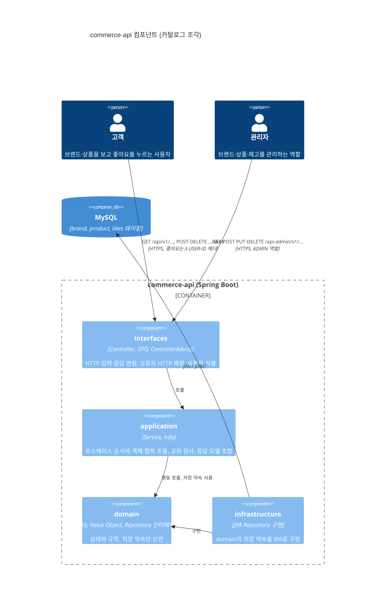
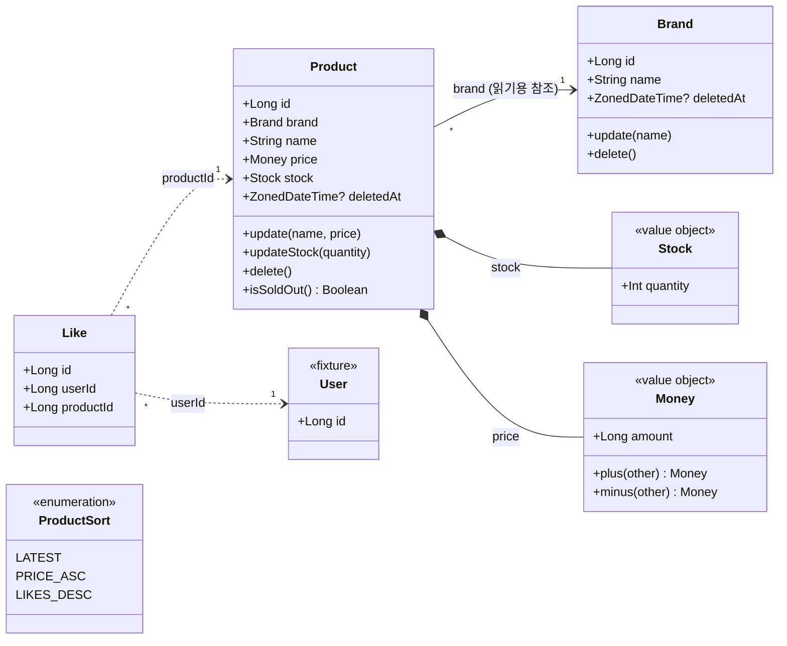
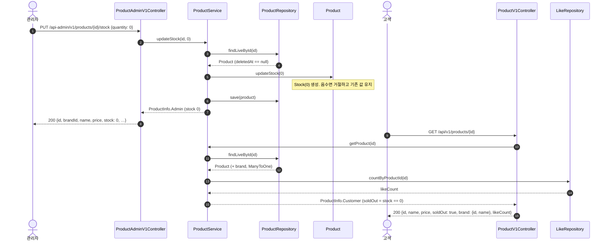

# 카탈로그 설계 — 브랜드, 상품, 좋아요

2주차 첫 번째 조각의 설계 문서다. 용어는 [`CONTEXT.md`](../../CONTEXT.md)를 따르고, 각 개념의 규칙·속성·행위는 [`docs/domain/catalog.md`](../domain/catalog.md)에 있다. 삭제 방식의 결정은 [ADR 0001](../adr/0001-soft-delete-catalog-hard-delete-like.md)이다.

범위: 고객의 브랜드 상세, 상품 목록·상세, 좋아요 누르기·취소·내 좋아요 목록. 관리자의 브랜드·상품 CRUD와 재고 변경. 포인트와 주문은 다음 조각이다.

## 1. 컴포넌트 다이어그램

과제의 "버드뷰"를 C4 컴포넌트 다이어그램으로 그린다. 고객과 관리자, API 서버 안의 네 계층, DB와 요청 방향을 담는다.

### 허용 의존 방향

`LayeredArchitectureTest`가 검사하는 규칙과 같다.

| 계층 | 맡는 일 | 의존해도 되는 것 | 의존하면 안 되는 것 |
| --- | --- | --- | --- |
| interfaces | 고객·관리자 입력과 응답, HTTP 오류 매핑, 요청자 식별 | application, domain | infrastructure |
| application | 유스케이스 순서, 교차 검사(브랜드 삭제 조건, 이름 중복, 브랜드 존재), 응답 모델 조합 | domain | interfaces, infrastructure |
| domain | 상태와 규칙, 저장 약속(repository 인터페이스) | 없음 | interfaces, application, infrastructure |
| infrastructure | repository 약속의 JPA 구현 | domain | interfaces, application |

패키지는 계층 아래 개념별로 둔다: `domain/brand`, `domain/product`, `domain/like`와 같은 이름을 application, infrastructure, `interfaces/api` 아래에도 둔다. 버전은 패키지가 아니라 클래스 이름에 붙인다(`BrandV1Controller`, `BrandAdminV1Controller`). 그래야 ArchUnit의 슬라이스 규칙이 개념 단위로 순환을 잡는다. application의 유스케이스 컴포넌트는 `Service` 접미사를 쓴다(`BrandService`). starter의 Example 코드가 쓰는 `Facade`와 domain의 `ExampleService`는 이 프로젝트의 이름 지침이 아니고, Example은 프로젝트가 자리를 잡으면 지운다.

### 요청자와 관리자 경계

- 고객 요청 중 좋아요 누르기·취소·내 목록은 API 게이트웨이가 넣어 준 `X-USER-ID` 헤더로 요청자를 식별한다. 브랜드·상품 조회는 요청자가 없어도 된다.
- 관리자 경계는 `/api-admin/**`에 ADMIN 역할을 요구한다. 이 경계는 통합 테스트에서만 존재한다. 과제가 제공하는 Spring Security 테스트 지원 설정(과제 원문 이름 `AdminBoundaryConfig`)을 `src/test`의 `@TestConfiguration` `com.loopers.config.security.AdminSecurityConfig`로 두고, 관리자 API를 부르는 테스트가 `@Import`로 명시해서 MockMvc의 `user().roles("ADMIN")`으로 실행한다. Spring Security 의존성도 test 범위에만 있으므로 운영 코드에는 인증이 없다. 관리자가 아니거나 식별이 없는 요청은 403이다(5.10).

## 2. 클래스 다이어그램

- 실선 `Product → Brand`는 JPA `@ManyToOne` 읽기 참조다. 애그리거트는 둘이며 저장소도 둘이다. 브랜드를 지울 수 있는지는 `Brand`가 아니라 application이 상품 저장소에 물어서 판단한다.
- 점선 `Like → Product`, `Like → User`는 식별자만 보관하는 관계다. 좋아요 수는 `Like`를 세어 구하고 `Product`에 저장하지 않는다.
- `deletedAt`은 `BaseEntity`에서 온다. `Like`는 `BaseEntity.delete()`를 쓰지 않고 행을 지운다(ADR 0001).

## 3. 대표 흐름 — 관리자 재고 변경 → 고객 상품 상세

관리자가 재고를 0으로 맞추고 고객이 같은 상품을 조회해 품절을 보는 흐름이다. 두 역할, 두 응답 모델, 삭제 필터가 한 그림에 들어간다.

같은 저장된 상품을 읽지만 응답 모델이 다르다. 관리자는 수량을 보고 고객은 품절 여부만 본다. 이 변환은 interfaces의 DTO가 맡고, `Product`는 두 응답의 존재를 모른다.

## 4. API 계약

공통: 응답은 `ApiResponse` 봉투를 쓴다. 목록은 `{ items, page, size, hasNext }`이며 `size + 1`개를 조회해 `hasNext`를 정한다. 총 개수는 주지 않는다. 오류는 `ErrorType`의 status·code·message로 내려간다. 도메인 규칙 거절(`RuleViolationException`)은 `BAD_REQUEST`의 status·code에 예외 메시지를 싣는다.

### 고객 `/api/v1`

| 기능 | method·path | 입력 | 성공 | 대표 오류 | 규칙 기대값 |
| --- | --- | --- | --- | --- | --- |
| 브랜드 상세 | `GET /brands/{brandId}` | path brandId | 200 `{id, name}` | 없거나 삭제됨 → 404 NOT_FOUND | 삭제된 브랜드는 없는 브랜드다 |
| 상품 목록 | `GET /products` | query `brandId?`, `page=0`, `size=20`, `sort=latest` | 200 `{items:[{id, name, price, soldOut, brand:{id,name}, likeCount}], page, size, hasNext}` | 모르는 sort, page<0, size∉1..100 → 400 BAD_REQUEST | 삭제된 상품 제외. 없는·삭제된 brandId 필터는 빈 목록. 정렬 동률은 id 내림차순 |
| 상품 상세 | `GET /products/{productId}` | path productId | 200 상품 목록의 항목과 같음 | 없거나 삭제됨 → 404 | 좋아요 수는 관계에서 센다 |
| 좋아요 누르기 | `POST /products/{productId}/likes` | 헤더 `X-USER-ID` | 200, data 없음 | 헤더 없음·없는 사용자 → 401 UNAUTHORIZED. 없거나 삭제된 상품 → 404 | 이미 있으면 그대로 두고 200. 관계는 사용자–상품 쌍마다 하나 |
| 좋아요 취소 | `DELETE /products/{productId}/likes` | 헤더 `X-USER-ID` | 200, data 없음 | 401 | 관계가 없어도 200. 삭제된 상품의 남은 좋아요도 취소된다 |
| 내 좋아요 목록 | `GET /users/{userId}/likes` | 헤더 `X-USER-ID`, path userId, `page`, `size` | 200 `{items:[상품 항목], page, size, hasNext}` | 401. path userId ≠ 요청자 → 403 FORBIDDEN | 삭제된 상품은 목록에서 뺀다. 최신 좋아요가 앞 |

### 관리자 `/api-admin/v1`

관리자 아님·식별 없음은 모든 행에서 403이다(관리자 경계, 테스트 지원 설정 기준). 아래 표에는 적지 않는다.

| 기능 | method·path | 입력 | 성공 | 대표 오류 | 규칙 기대값 |
| --- | --- | --- | --- | --- | --- |
| 브랜드 목록 | `GET /brands` | `page`, `size` | 200 `{items:[{id, name, createdAt, updatedAt}], …}` | 400 paging | 삭제된 브랜드 제외. 최신 등록이 앞 |
| 브랜드 등록 | `POST /brands` | `{name}` | 201 브랜드 | 이름 공백·100자 초과 → 400. 삭제되지 않은 브랜드와 이름 중복 → 409 CONFLICT | 이름은 trim 후 검사 |
| 브랜드 상세 | `GET /brands/{brandId}` | path | 200 브랜드 | 없거나 삭제됨 → 404 | |
| 브랜드 수정 | `PUT /brands/{brandId}` | `{name}` | 200 브랜드 | 404, 400, 409 | 거절 시 기존 값 유지 |
| 브랜드 삭제 | `DELETE /brands/{brandId}` | path | 200, data 없음 | 404. 삭제되지 않은 상품이 남음 → 409 | 재고 0인 상품도 남은 상품이다. 이미 삭제된 브랜드는 404 |
| 상품 목록 | `GET /products` | `brandId?`, `page`, `size` | 200 `{items:[{id, brandId, name, price, stock, createdAt, updatedAt}], …}` | 400 paging | 삭제된 상품 제외 |
| 상품 등록 | `POST /products` | `{brandId, name, price, stock}` | 201 상품 | 없거나 삭제된 brandId → 404. 이름·가격·재고 범위 → 400 | 가격 1..1,000,000,000원, 재고 0 이상 |
| 상품 상세 | `GET /products/{productId}` | path | 200 상품 | 404 | |
| 상품 수정 | `PUT /products/{productId}` | `{name, price}` | 200 상품 | 404, 400 | 브랜드는 바꿀 수 없다. 거절 시 기존 값 유지 |
| 상품 삭제 | `DELETE /products/{productId}` | path | 200, data 없음 | 404 | 남은 좋아요는 그대로 둔다 |
| 재고 변경 | `PUT /products/{productId}/stock` | `{quantity}` | 200 상품 | 404. quantity<0 → 400 | 최종 수량으로 맞춘다. 0 허용. 거절 시 기존 값 유지 |

### 오류 코드

`ErrorType`에 행을 더한다. 1주차 방식대로 같은 HTTP status와 code 문자열을 공유하고 message만 다르다. 새 status가 필요한 둘은 code도 새로 갖는다.

| 상수 | status | 쓰는 곳 |
| --- | --- | --- |
| `UNAUTHORIZED` (신규 status) | 401 | 헤더 없음, 없는 사용자 |
| `FORBIDDEN` (신규 status) | 403 | path userId가 요청자와 다름 |
| `BRAND_NOT_FOUND`, `PRODUCT_NOT_FOUND` | 404, code는 NOT_FOUND와 같음 | 없거나 삭제된 대상 |
| `BRAND_NAME_DUPLICATED`, `BRAND_HAS_PRODUCTS` | 409, code는 CONFLICT와 같음 | 이름 중복, 삭제 조건 |
| `INVALID_PAGE`, `INVALID_SORT` | 400, code는 BAD_REQUEST와 같음 | 목록 입력 |

도메인 규칙의 거절은 `ErrorType`에 행을 두지 않는다. `RuleViolationException`의 하위 예외(`InvalidNameException`, `InvalidPriceException`, `InvalidStockException`)이며 `ApiControllerAdvice`가 한 곳에서 400 `BAD_REQUEST`로 옮긴다. 까닭은 5.12에 있다.

## 5. 대안 비교와 선택 이유

설계 인터뷰에서 대안을 놓고 고른 것들이다. 각 항목의 마지막 줄이 다시 볼 조건이다.

### 5.1 브랜드와 상품의 애그리거트 경계

- 대안 A: 브랜드가 루트인 하나의 애그리거트. 상품 등록이 브랜드를 거치고 삭제 조건이 `Brand` 안의 불변식이 된다.
- 대안 B: 브랜드와 상품은 각자 애그리거트. 상품이 브랜드를 `@ManyToOne`으로 읽기 참조한다. 삭제 조건은 application이 상품 저장소에 묻는다.
- 선택: B. 상품 목록은 브랜드를 가로질러 페이지로 조회되고 관리자는 상품을 자기 식별자로 고친다. A에서는 상품 하나를 고칠 때마다 브랜드의 상품 전체를 싣는다. 두 개념을 묶는 불변식은 "삭제 조건" 하나뿐이고 그것은 조회로 지킬 수 있다.
- 다시 볼 조건: 브랜드 단위로 상품을 한꺼번에 바꾸는 요구가 생길 때.

### 5.2 삭제 방식

ADR 0001. 브랜드·상품은 논리 삭제, 좋아요는 물리 삭제. 근거는 "삭제된 상품에 남은 좋아요를 취소할 수 있게" 하라는 과제 조건이다.

### 5.3 재고의 형태

- 대안 A: `Product` 안의 값 객체 `Stock`.
- 대안 B: `product_id`를 키로 가진 별도 엔티티.
- 대안 C: `Product`의 정수 필드.
- 선택: A. "0 아래로 내려가지 않는다"가 작은 타입 하나에 모이고 Spring 없이 테스트된다. 관리자 재고 변경은 `Product.updateStock`이 새 `Stock`으로 바꾼다.
- 다시 볼 조건: 주문 확정의 재고 차감이 들어오고 상품 행 전체가 아니라 재고 행만 잠가야 할 때 B로 뺀다.

### 5.4 금액의 타입

- 대안: `Long`, `BigInteger`, `BigDecimal`.
- 선택: `@Embeddable class Money(val amount: Long)`. 원화는 정수이고 상품 가격 상한 10억 원과 이후 주문 합계는 `Long` 안에 넉넉히 든다. 더하기·곱하기는 `Math.addExact`·`multiplyExact`로 넘침을 잡아 거절한다. `BigInteger`는 메모리에서는 넘치지 않지만 DB 컬럼에서 넘치므로 범위 검사가 사라지지 않고 산술만 불편해진다. Kotlin `value class`는 Hibernate가 embeddable로 매핑하지 못한다.
- `Money`는 0 이상, `Product.price`는 1원 이상. 값 자체의 유효성과 행동의 입력 조건을 나눈다.

### 5.5 목록 응답

- 대안 A: `totalElements`·`totalPages`를 주는 페이지.
- 대안 B: `hasNext`만 주는 슬라이스.
- 선택: B. 과제에 총 개수 요구가 없다. count 쿼리는 삭제 필터와 브랜드 필터, 좋아요 수 조인을 한 번 더 반복하는 자리이고, ADR 0001이 적은 "필터를 빠뜨리기 쉽다"는 비용을 키운다. 필드를 더하는 것은 깨지는 변경이 아니다.

### 5.6 좋아요의 반복 요청

- 대안 A: 멱등. 두 번 눌러도 200, 없는 관계를 취소해도 200.
- 대안 B: 엄격. 두 번 누르면 409, 없는 관계 취소는 404.
- 선택: A. 클라이언트는 원하는 최종 상태를 말한다. 유일 제약은 그대로 두되 오류로 드러내지 않는다.

### 5.7 고객·관리자 응답 모델

- 선택: 고객 상품 응답은 수량 대신 `soldOut`을, 관리자 응답은 수량과 시각을 준다. 같은 `Product`를 읽어도 두 응답은 interfaces의 DTO에서 갈라진다. `Product`는 어느 응답의 존재도 모른다.
- 반례 대입: "브랜드 응답이 바뀌면 어떤 객체까지 바뀌는가?" — 고객 상품 응답 DTO만 바뀐다. `Product`, `Brand`, application의 `Info`는 그대로다.

### 5.8 교차 검사의 위치

브랜드 삭제 조건, 브랜드 이름 중복, 상품 등록 시 브랜드 존재는 application의 Service에서 저장소를 조회해 확인한다. 각 검사가 조회 하나와 거절 하나라서 도메인 서비스로 뺄 규칙이 아직 없다. 규칙이 자라면 그때 도메인 서비스로 옮긴다.

### 5.9 카탈로그 조회의 식별

브랜드·상품 조회는 요청자 없이 된다. 과제의 "자신의 좋아요·포인트·주문만" 문장이 식별이 필요한 곳을 정확히 셋으로 적고 있고, 조회 계약은 누가 부르는지에 의존하지 않는다.

### 5.10 관리자 경계 설정의 위치

- 문제: 과제는 관리자 경계 설정(`AdminBoundaryConfig`)과 Spring Security 의존성을 main에 둔다. 그러나 체인에 로그인 수단이 없어 운영 코드의 `/api-admin/**`은 누구도 통과하지 못하고, 설정은 오직 테스트를 위해 존재한다. 또 `LayeredArchitectureTest`가 이 클래스를 어느 계층에 넣을지 정해야 한다.
- 대안 A: main에 두고 `com.loopers.config..`를 `config` 계층으로 이름 붙인다(2026-09-16 선택). 과제 원문과 같고 운영에서 관리자 경로가 닫힌 채로 남는다.
- 대안 B: `src/test`에 평범한 `@Configuration`으로 둔다. 컴포넌트 스캔이 모든 테스트 컨텍스트에 넣어 주므로 `@Import`가 필요 없지만, 테스트 클래스패스의 빈이 암묵적으로 끼어든다.
- 대안 C: `src/test`에 `@TestConfiguration`으로 두고 관리자 API 테스트가 `@Import`로 명시한다. 의존성도 test 범위로 내린다.
- 선택: C (2026-09-17). 통합 테스트만을 위한 빈임을 코드에서 드러낸다. 운영 코드에서 Spring Security가 사라지므로 `config` 계층은 지운다. 대가: Spring Security가 테스트 클래스패스에 있으므로 이 빈을 import하지 않은 컨텍스트에는 Boot 기본 체인(모든 경로에 인증 요구)이 들어가고, HTTP를 보내는 고객 API 테스트가 401을 받는다.
- 다시 볼 조건: 기본 체인이 다른 테스트 컨텍스트에서 문제를 일으킬 때(대안 B로 전환), 또는 운영 인증이 실제로 생길 때(main으로 복귀).

### 5.11 브랜드 등록의 검사 순서

- `docs/domain/catalog.md`의 첫 안은 "이름 중복 조회 → `Brand(name)`"이었다. 구현(#2)에서는 `Brand(name)`을 먼저 만든다.
- 이유: 중복은 trim된 이름끼리 비교해야 한다(`" 루퍼스 "`와 `"루퍼스"`는 같은 이름). 또 공백뿐인 이름은 조회 없이 400으로 끝난다. 두 검사가 모두 걸리면 400이 409보다 먼저다.

### 5.12 도메인 규칙 거절의 표현

- 문제: `ErrorType`은 `HttpStatus`를 품으므로 엔티티가 `CoreException`을 던지면 도메인이 HTTP 전송에 기댄다.
- 대안 A: 엔티티는 `require()`로 불변식만 지키고(어기면 버그, 500), application이 같은 규칙을 먼저 검사해 `CoreException`을 던진다. 규칙이 두 곳에 적히고 상품의 가격·재고로 갈수록 늘어난다. `IllegalArgumentException`을 400으로 옮기는 방법은 라이브러리 버그까지 400으로 바꾼다.
- 대안 B: `spring-boot-starter-validation`으로 요청 DTO나 서비스 인자를 검사한다. `@Size`는 trim 전 길이를 재므로 "뗀 뒤 100자" 규칙과 어긋나고, 서비스 메서드 검증은 프록시가 있어야 해서 fake 저장소로 만든 서비스 테스트에서 돌지 않는다. 예외 타입도 둘 늘어난다.
- 대안 C: 도메인이 가진 예외로 거절한다. 추상 `RuleViolationException` 아래 규칙마다 하위 예외를 두고, advice가 상위 타입 하나로 400에 옮긴다.
- 선택: C (2026-09-17). 규칙이 한 곳에 남고 HTTP 응답(400, `Bad Request`, 메시지)은 그대로다. 표식 인터페이스는 `@ExceptionHandler`가 `Throwable` 하위 클래스만 받으므로 쓰지 않는다. 하위 예외가 여러 패키지에 놓이므로 `sealed`가 아니라 `abstract`다.
- 다시 볼 조건: 규칙마다 다른 응답 code가 필요할 때(하위 예외별 핸들러 추가), 또는 목록 입력처럼 도메인 뜻이 없는 검사가 늘 때(대안 B를 그 입력에만 도입).

## 6. 테스트 경계

| 확인할 것 | 테스트 | 비고 |
| --- | --- | --- |
| `Stock`: 음수 거절과 기존 값 유지, 0 허용, 양수 저장 | domain 단위 테스트, TDD 대표 사례 | Spring·DB 없음 |
| `Money`: 음수 거절, 넘침 거절 | domain 단위 테스트 | |
| `Product`: 이름·가격 범위, 브랜드 불변 | domain 단위 테스트 | |
| 브랜드 삭제 조건, 이름 중복, 요청자 구분 | application 테스트, 저장소 fake | |
| 삭제 필터, 좋아요 수 집계, 정렬·동률, `hasNext` | repository·DB 통합 테스트, flush/clear 후 재조회 | 읽기 경로마다 "삭제된 대상은 없는 대상" |
| 고객·관리자 응답 필드, 401·403·404·409 | HTTP 테스트. 관리자는 MockMvc + `user().roles("ADMIN")` + `csrf()` | 거절 시 기존 값 유지 확인 |

## 7. 남은 것

- 내 좋아요 목록을 `GET /api/v1/likes`로 줄이는 것은 확인 후 결정한다. 줄이면 403 경우와 `FORBIDDEN`이 이 조각에서 사라진다.
- 상품 등록 입력의 `stock`은 필수 0 이상으로 두었다. 초기 재고를 재고 변경 API로만 넣게 할지는 구현하며 다시 본다.
- 재고를 별도 엔티티로 빼는 시점은 주문 조각에서 정한다.
