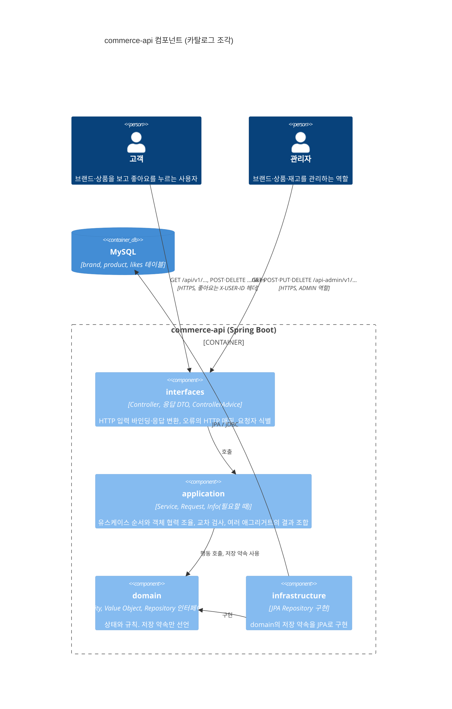
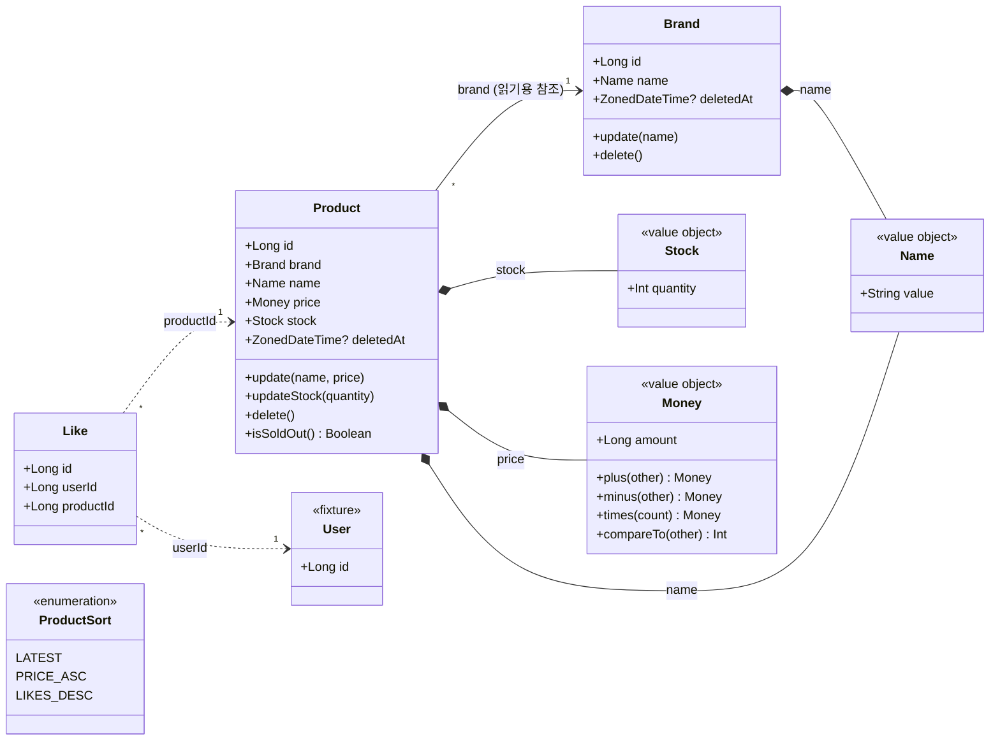
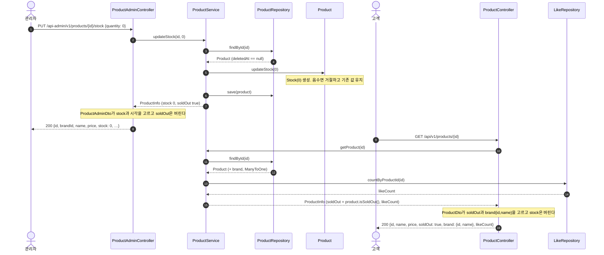

# 카탈로그 설계 — 브랜드, 상품, 좋아요

2주차 첫 번째 조각의 설계 문서다. 용어는 [`CONTEXT.md`](../../CONTEXT.md)를 따르고, 각 개념의 규칙·속성·행위는 [`docs/domain/catalog.md`](../domain/catalog.md)에 있다. 삭제 방식의 결정은 [ADR 0001](../adr/0001-soft-delete-catalog-hard-delete-like.md)이다.

범위: 고객의 브랜드 상세, 상품 목록·상세, 좋아요 누르기·취소·내 좋아요 목록. 관리자의 브랜드·상품 CRUD와 재고 변경. 포인트와 주문은 다음 조각이다.

## 1. 컴포넌트 다이어그램

과제의 "버드뷰"를 C4 컴포넌트 다이어그램으로 그린다. 고객과 관리자, API 서버 안의 네 계층, DB와 요청 방향을 담는다.

### 허용 의존 방향

`LayeredArchitectureTest`가 검사하는 규칙과 같다.

| 계층 | 맡는 일 | 의존해도 되는 것 | 의존하면 안 되는 것 |
| --- | --- | --- | --- |
| interfaces | 고객·관리자 입력과 응답, HTTP 오류 매핑, 요청자 식별 | application, domain | infrastructure |
| application | 유스케이스 순서, 교차 검사(브랜드 삭제 조건, 이름 중복, 브랜드 존재), 응답 모델 조합 | domain | interfaces, infrastructure |
| domain | 상태와 규칙, 저장 약속(repository 인터페이스) | 없음 | interfaces, application, infrastructure |
| infrastructure | repository 약속의 JPA 구현 | domain | interfaces, application |

패키지는 계층 아래 개념별로 둔다: `domain/brand`, `domain/product`, `domain/like`와 같은 이름을 application, infrastructure, `interfaces/api` 아래에도 둔다. API 버전은 클래스 이름이 아니라 `interfaces/api` 바로 아래 패키지에 붙인다(`interfaces/api/v1/brand/BrandController`, `BrandAdminController`). URL `/api/v1/...`과 패키지가 같은 모양이고, 학습용 저장소라 v1에서 끝나므로 버전 우선 배치가 개념 우선(`brand/v1`)보다 단순하다. 개념 사이 순환은 계층마다 따로 검사한다(5.16). interfaces의 슬라이스 규칙은 `api.v*` 세그먼트를 건너뛰고 그다음 세그먼트를 개념으로 잡는다. application의 유스케이스 컴포넌트는 `Service` 접미사를 쓰고 `Facade`는 쓰지 않는다(`BrandService`). 유스케이스 입력은 application에 `<개념><동사>Request`로 둔다(`ProductRegisterRequest`, 5.17). domain 계층에는 `Service`를 붙인 클래스를 두지 않는다. 여러 개념이 함께 쓰는 값 객체(`Name`, `Money`)는 `domain/shared`에 두고, 한 개념만 쓰는 값 객체(`Stock`)는 그 개념 패키지에 둔다(5.14).

### 요청자와 관리자 경계

- 고객 요청 중 좋아요 누르기·취소·내 목록은 API 게이트웨이가 넣어 준 `X-USER-ID` 헤더로 요청자를 식별한다. 브랜드·상품 조회는 요청자가 없어도 된다.
- 관리자 경계는 `/api-admin/**`에 ADMIN 역할을 요구한다. 이 경계는 통합 테스트에서만 존재한다. 과제가 제공하는 Spring Security 테스트 지원 설정(과제 원문 이름 `AdminBoundaryConfig`)을 `src/test`의 `@TestConfiguration` `com.loopers.config.security.AdminSecurityConfig`로 두고, 관리자 API를 부르는 테스트가 `@Import`로 명시해서 MockMvc의 `user().roles("ADMIN")`으로 실행한다. Spring Security 의존성도 test 범위에만 있으므로 운영 코드에는 인증이 없다. 관리자가 아니거나 식별이 없는 요청은 403이다(5.10).

## 2. 클래스 다이어그램

- 실선 `Product → Brand`는 JPA `@ManyToOne` 읽기 참조다. 애그리거트는 둘이며 저장소도 둘이다. 브랜드를 지울 수 있는지는 `Brand`가 아니라 application이 상품 저장소에 물어서 판단한다.
- 점선 `Like → Product`, `Like → User`는 식별자만 보관하는 관계다. 좋아요 수는 `Like`를 세어 구하고 `Product`에 저장하지 않는다.
- `deletedAt`은 `BaseEntity`에서 온다. `Like`는 `BaseEntity.delete()`를 쓰지 않고 행을 지운다(ADR 0001).

## 3. 대표 흐름 — 관리자 재고 변경 → 고객 상품 상세

관리자가 재고를 0으로 맞추고 고객이 같은 상품을 조회해 품절을 보는 흐름이다. 두 역할, 하나의 응답 모델과 두 응답 DTO, 삭제 필터가 한 그림에 들어간다.

같은 저장된 상품을 읽고 같은 `ProductInfo`를 받지만 응답 JSON이 다르다. 관리자는 수량을 보고 고객은 품절 여부만 본다. `ProductService`는 누가 부르는지 모르고 한 가지 `ProductInfo`만 트랜잭션 안에서 채운다. 어느 필드를 내보낼지는 역할별 컨트롤러 옆의 응답 DTO(`ProductAdminDto`, `ProductDto`)가 고른다. `Product`는 두 응답의 존재를 모르고 `isSoldOut()`만 안다. 언제 `Info`를 두는지는 5.7에 있다.

## 4. API 계약

공통: 응답은 `ApiResponse` 봉투를 쓴다. 목록은 `{ items, page, size, hasNext }`이며 `size + 1`개를 조회해 `hasNext`를 정한다. 총 개수는 주지 않는다. 오류는 `ErrorType`의 status·code·message로 내려간다. 도메인 규칙 거절(`RuleViolationException`)은 `BAD_REQUEST`의 status·code에 예외 메시지를 싣는다.

### 고객 `/api/v1`

| 기능 | method·path | 입력 | 성공 | 대표 오류 | 규칙 기대값 |
| --- | --- | --- | --- | --- | --- |
| 브랜드 상세 | `GET /brands/{brandId}` | path brandId | 200 `{id, name}` | 없거나 삭제됨 → 404 NOT_FOUND | 삭제된 브랜드는 없는 브랜드다 |
| 상품 목록 | `GET /products` | query `brandId?`, `page=0`, `size=20`, `sort=latest` | 200 `{items:[{id, name, price, soldOut, brand:{id,name}, likeCount}], page, size, hasNext}` | 모르는 sort, page<0, size∉1..100 → 400 BAD_REQUEST | 삭제된 상품 제외. 없는·삭제된 brandId 필터는 빈 목록. 정렬 동률은 id 내림차순 |
| 상품 상세 | `GET /products/{productId}` | path productId | 200 상품 목록의 항목과 같음 | 없거나 삭제됨 → 404 | 좋아요 수는 관계에서 센다 |
| 좋아요 누르기 | `POST /products/{productId}/likes` | 헤더 `X-USER-ID` | 200, data 없음 | 헤더 없음·없는 사용자 → 401 UNAUTHORIZED. 없거나 삭제된 상품 → 404 | 이미 있으면 그대로 두고 200. 관계는 사용자–상품 쌍마다 하나 |
| 좋아요 취소 | `DELETE /products/{productId}/likes` | 헤더 `X-USER-ID` | 200, data 없음 | 401 | 관계가 없어도 200. 삭제된 상품의 남은 좋아요도 취소된다 |
| 내 좋아요 목록 | `GET /users/{userId}/likes` | 헤더 `X-USER-ID`, path userId, `page`, `size` | 200 `{items:[상품 항목], page, size, hasNext}` | 401. path userId ≠ 요청자 → 403 FORBIDDEN | 삭제된 상품은 목록에서 뺀다. 최신 좋아요가 앞 |

### 관리자 `/api-admin/v1`

관리자 아님·식별 없음은 모든 행에서 403이다(관리자 경계, 테스트 지원 설정 기준). 아래 표에는 적지 않는다.

| 기능 | method·path | 입력 | 성공 | 대표 오류 | 규칙 기대값 |
| --- | --- | --- | --- | --- | --- |
| 브랜드 목록 | `GET /brands` | `page`, `size` | 200 `{items:[{id, name, createdAt, updatedAt}], …}` | 400 paging | 삭제된 브랜드 제외. 최신 등록이 앞 |
| 브랜드 등록 | `POST /brands` | `{name}` | 201 브랜드 | 이름 공백·100자 초과 → 400. 삭제되지 않은 브랜드와 이름 중복 → 409 CONFLICT | 이름은 trim 후 검사. 중복은 대소문자 무시(5.13) |
| 브랜드 상세 | `GET /brands/{brandId}` | path | 200 브랜드 | 없거나 삭제됨 → 404 | |
| 브랜드 수정 | `PUT /brands/{brandId}` | `{name}` | 200 브랜드 | 404, 400, 409 | 거절 시 기존 값 유지 |
| 브랜드 삭제 | `DELETE /brands/{brandId}` | path | 200, data 없음 | 404. 삭제되지 않은 상품이 남음 → 409 | 재고 0인 상품도 남은 상품이다. 이미 삭제된 브랜드는 404 |
| 상품 목록 | `GET /products` | `brandId?`, `page`, `size` | 200 `{items:[{id, brandId, name, price, stock, createdAt, updatedAt}], …}` | 400 paging | 삭제된 상품 제외 |
| 상품 등록 | `POST /products` | `{brandId, name, price, stock}` | 201 상품 | 없거나 삭제된 brandId → 404. 이름·가격·재고 범위 → 400 | 가격 1..1,000,000,000원, 재고 0 이상 |
| 상품 상세 | `GET /products/{productId}` | path | 200 상품 | 404 | |
| 상품 수정 | `PUT /products/{productId}` | `{name, price}` | 200 상품 | 404, 400 | 브랜드는 바꿀 수 없다. 거절 시 기존 값 유지 |
| 상품 삭제 | `DELETE /products/{productId}` | path | 200, data 없음 | 404 | 남은 좋아요는 그대로 둔다 |
| 재고 변경 | `PUT /products/{productId}/stock` | `{quantity}` | 200 상품 | 404. quantity<0 → 400 | 최종 수량으로 맞춘다. 0 허용. 거절 시 기존 값 유지 |

### 오류 코드

`ErrorType`에 행을 더한다. 1주차 방식대로 같은 HTTP status와 code 문자열을 공유하고 message만 다르다. 새 status가 필요한 둘은 code도 새로 갖는다.

| 상수 | status | 쓰는 곳 |
| --- | --- | --- |
| `UNAUTHORIZED` (신규 status) | 401 | 헤더 없음, 없는 사용자 |
| `FORBIDDEN` (신규 status) | 403 | path userId가 요청자와 다름 |
| `BRAND_NOT_FOUND`, `PRODUCT_NOT_FOUND` | 404, code는 NOT_FOUND와 같음 | 없거나 삭제된 대상 |
| `BRAND_NAME_DUPLICATED`, `BRAND_HAS_PRODUCTS` | 409, code는 CONFLICT와 같음 | 이름 중복, 삭제 조건 |
| `INVALID_PAGE`, `INVALID_SORT` | 400, code는 BAD_REQUEST와 같음 | 목록 입력 |

도메인 규칙의 거절은 `ErrorType`에 행을 두지 않는다. `RuleViolationException`의 하위 예외(`InvalidNameException`, `InvalidMoneyException`, `InvalidPriceException`, `InvalidStockException`)이며 `ApiControllerAdvice`가 한 곳에서 400 `BAD_REQUEST`로 옮긴다. 까닭은 5.12에 있다.

## 5. 대안 비교와 선택 이유

설계 인터뷰에서 대안을 놓고 고른 것들이다. 각 항목의 마지막 줄이 다시 볼 조건이다.

### 5.1 브랜드와 상품의 애그리거트 경계

- 대안 A: 브랜드가 루트인 하나의 애그리거트. 상품 등록이 브랜드를 거치고 삭제 조건이 `Brand` 안의 불변식이 된다.
- 대안 B: 브랜드와 상품은 각자 애그리거트. 상품이 브랜드를 `@ManyToOne`으로 읽기 참조한다. 삭제 조건은 application이 상품 저장소에 묻는다.
- 대안 C: B처럼 애그리거트를 나누되 상품은 `brandId`만 가진다. 다른 애그리거트는 식별자로만 참조한다는 Vernon의 규칙을 그대로 따른다.
- 선택: B.
  - A가 아닌 까닭: 상품 목록은 브랜드를 가로질러 페이지로 조회되고 관리자는 상품을 자기 식별자로 고친다. A에서는 상품 하나를 고칠 때마다 브랜드의 상품 전체를 싣는다. 두 개념을 묶는 불변식은 "삭제 조건" 하나뿐이고 그것은 조회로 지킬 수 있다.
  - C가 아닌 까닭: `product.brand_id → brand.id` 외래 키를 유지한다. local·test는 `ddl-auto: create`이고 마이그레이션 스크립트가 없어서 외래 키는 연관에서만 생긴다. 고객 상품 응답의 브랜드 `{id, name}`도 연관을 따라 바로 읽는다. 브랜드는 상품을 만들 때 정해지고 바뀌지 않으므로 연관이 상품에 바뀌는 상태를 더하지 않는다. 식별자 참조가 막으려는 것은 한 애그리거트가 다른 애그리거트의 상태를 바꾸는 일이고, 그것은 아래 규칙과 아키텍처 테스트로 막는다.
- 연관이 있어도 애그리거트는 둘이다. 지키는 규칙은 셋이다.
  - 한 트랜잭션은 애그리거트 하나만 바꾼다. 상품은 `brand`를 읽기만 한다. 영속성 컨텍스트가 관리하는 `Brand`는 cascade가 없어도 dirty checking으로 저장되므로, `product.brand`에서 상태를 바꾸는 메서드를 부르면 브랜드도 함께 바뀐다.
  - 연관은 상품에서 브랜드로 가는 한 방향이다. `Brand`는 상품 컬렉션을 갖지 않는다. cascade가 없고 `updatable = false`다.
  - 브랜드 삭제 거절(살아 있는 상품이 남으면 409)이 "살아 있는 상품의 브랜드는 살아 있다"를 보장한다. 그래서 `@SQLRestriction`으로 삭제된 행을 숨기는 `Brand`를 살아 있는 상품에서 언제나 읽을 수 있다. 삭제 조건을 풀거나 연쇄 삭제로 바꾸면 이 연관을 다시 본다.
- 아키텍처 테스트: `LayeredArchitectureTest.domainSlicesOnlyReadEachOther`. `domain` 아래 한 조각(`brand`, `product`, `shared` …)의 클래스가 다른 조각 클래스에서 부를 수 있는 메서드는 셋뿐이다. getter(`get`·`is`로 시작하고 인자가 없으며 값을 돌려준다), enum의 메서드, record의 메서드다. Kotlin에는 record가 없으므로 프로퍼티가 모두 `val`인 data class(`Money`, `Stock`)를 record로 본다. 생성자 호출은 메서드 호출이 아니므로 다른 조각의 값 객체와 예외는 만들 수 있다.
  - 이 테스트는 domain 계층만 본다. application의 Service는 다른 조각의 저장소를 불러야 하므로 테스트 밖이고, 그곳에서 `product.brand`의 상태를 바꾸지 않는 것은 리뷰로 지킨다.
  - 이름이 getter처럼 생긴 변경 메서드(`getAndIncrement` 같은 것)는 잡지 못한다. 그런 이름을 쓰지 않는다.
- 다시 볼 조건: 브랜드 단위로 상품을 한꺼번에 바꾸는 요구가 생기면 A를 다시 본다. 브랜드와 상품을 다른 모듈이나 서비스로 나누거나, 브랜드를 바꾸는 흐름이 상품을 읽은 트랜잭션 안에 들어와야 하면 C로 옮긴다.

### 5.2 삭제 방식

ADR 0001. 브랜드·상품은 논리 삭제, 좋아요는 물리 삭제. 근거는 "삭제된 상품에 남은 좋아요를 취소할 수 있게" 하라는 과제 조건이다.

### 5.3 재고의 형태

- 대안 A: `Product` 안의 값 객체 `Stock`.
- 대안 B: `product_id`를 키로 가진 별도 엔티티.
- 대안 C: `Product`의 정수 필드.
- 선택: A. "0 아래로 내려가지 않는다"가 작은 타입 하나에 모이고 Spring 없이 테스트된다. 관리자 재고 변경은 `Product.updateStock`이 새 `Stock`으로 바꾼다.
- 다시 볼 조건: 주문 확정의 재고 차감이 들어오고 상품 행 전체가 아니라 재고 행만 잠가야 할 때 B로 뺀다.

### 5.4 금액의 타입

- 대안: `Long`, `BigInteger`, `BigDecimal`.
- 선택: `@Embeddable class Money(val amount: Long)`. 원화는 정수이고 상품 가격 상한 10억 원과 이후 주문 합계는 `Long` 안에 넉넉히 든다. 더하기·곱하기는 `Math.addExact`·`multiplyExact`로 넘침을 잡아 `InvalidMoneyException`으로 거절한다(`ArithmeticException`을 그대로 두면 500이 된다). `BigInteger`는 메모리에서는 넘치지 않지만 DB 컬럼에서 넘치므로 범위 검사가 사라지지 않고 산술만 불편해진다. Kotlin `value class`는 Hibernate가 embeddable로 매핑하지 못한다.
- `Money`는 0 이상, `Product.price`는 1원 이상. 값 자체의 유효성과 행동의 입력 조건을 나눈다.

### 5.5 목록 응답

- 대안 A: `totalElements`·`totalPages`를 주는 페이지.
- 대안 B: `hasNext`만 주는 슬라이스.
- 선택: B. 과제에 총 개수 요구가 없다. count 쿼리는 삭제 필터와 브랜드 필터, 좋아요 수 조인을 한 번 더 반복하는 자리이고, ADR 0001이 적은 "필터를 빠뜨리기 쉽다"는 비용을 키운다. 필드를 더하는 것은 깨지는 변경이 아니다.

### 5.6 좋아요의 반복 요청

- 대안 A: 멱등. 두 번 눌러도 200, 없는 관계를 취소해도 200.
- 대안 B: 엄격. 두 번 누르면 409, 없는 관계 취소는 404.
- 선택: A. 클라이언트는 원하는 최종 상태를 말한다. 유일 제약은 그대로 두되 오류로 드러내지 않는다.

### 5.7 고객·관리자 응답 모델

- 선택: 고객 상품 응답은 수량 대신 `soldOut`을, 관리자 응답은 수량과 시각을 준다. 같은 `Product`를 읽어 application은 역할을 모르는 하나의 `ProductInfo`(id, brandId, brandName, name, price, stock, soldOut, createdAt, updatedAt, 좋아요 티켓에서 likeCount)를 채우고, interfaces의 역할별 DTO(`ProductAdminDto`, `ProductDto`)가 각자 내보낼 필드를 고른다. `soldOut`은 `Product.isSoldOut()`에서 오고 DTO는 계산하지 않는다. `Product`는 어느 응답의 존재도 모른다.
- 역할 분기를 interfaces에 두는 까닭: 관리자와 고객은 이미 `/api-admin`·`/api` 컨트롤러로 갈라져 있다. Service가 역할별 `Info`를 만들면 같은 지식이 한 층 아래에 한 번 더 생긴다. Service가 아는 것은 얼마나 읽었는가(목록·상세)이지 누가 보는가가 아니다. 과제 템플릿의 `ExampleInfo` → `ExampleV1Dto.ExampleResponse`도 애그리거트당 `Info` 하나, 엔드포인트당 응답 하나다.
- `Info`를 두는 기준: Service는 연관이 없는 엔티티 하나로 답이 끝나면 그 엔티티를 돌려준다(`BrandService` → `Brand`). 연관을 건너 읽거나(`Product` → `Brand`, `@ManyToOne`) 다른 저장소의 값을 더해야 하면(좋아요 수) 트랜잭션 안에서 `Info`로 옮겨 돌려준다. `open-in-view: false`라 트랜잭션 밖의 지연 로딩은 실패하기 때문이다. 필드를 그대로 베끼기만 하는 `Info`는 두지 않는다.
- 받아들이는 비용: 관리자 상세도 `likeCount`를 위한 count 쿼리 한 번을 치른다. 등록 응답은 새 상품에 좋아요가 없다는 불변식으로 0을 넣는다. `ProductInfo`는 직렬화되지 않으므로 고객 JSON에서 `stock`이 빠지는 것은 `ProductDto.from`의 명시적 필드 선택과 HTTP 테스트가 지킨다. 컨트롤러가 `Info`를 그대로 돌려주지 않는다.
- 반례 대입: "브랜드 응답이 바뀌면 어떤 객체까지 바뀌는가?" — 고객 상품 응답 DTO와 `ProductInfo.brandName`만 바뀐다. `Product`, `Brand`는 그대로다.
- 다시 볼 조건: `Brand`에 지연 연관이 생기거나 브랜드 응답이 다른 저장소의 값을 필요로 할 때 `BrandInfo`를 둔다. 한쪽 역할만 쓰는 필드가 별도 조회를 필요로 하게 되면(같은 행 + 집계 하나를 넘어서면) 그 읽기 경로에 자기 조회 모델을 두고 `ProductInfo`를 다시 가른다. 선택적 필드로 버티지 않는다.

### 5.8 교차 검사의 위치

브랜드 삭제 조건, 브랜드 이름 중복, 상품 등록 시 브랜드 존재는 application의 Service에서 저장소를 조회해 확인한다. 각 검사가 조회 하나와 거절 하나라서 도메인 서비스로 뺄 규칙이 아직 없다. 규칙이 자라면 그때 도메인 서비스로 옮긴다.

### 5.9 카탈로그 조회의 식별

브랜드·상품 조회는 요청자 없이 된다. 과제의 "자신의 좋아요·포인트·주문만" 문장이 식별이 필요한 곳을 정확히 셋으로 적고 있고, 조회 계약은 누가 부르는지에 의존하지 않는다.

### 5.10 관리자 경계 설정의 위치

- 문제: 과제는 관리자 경계 설정(`AdminBoundaryConfig`)과 Spring Security 의존성을 main에 둔다. 그러나 체인에 로그인 수단이 없어 운영 코드의 `/api-admin/**`은 누구도 통과하지 못하고, 설정은 오직 테스트를 위해 존재한다. 또 `LayeredArchitectureTest`가 이 클래스를 어느 계층에 넣을지 정해야 한다.
- 대안 A: main에 두고 `com.loopers.config..`를 `config` 계층으로 이름 붙인다(2026-09-16 선택). 과제 원문과 같고 운영에서 관리자 경로가 닫힌 채로 남는다.
- 대안 B: `src/test`에 평범한 `@Configuration`으로 둔다. 컴포넌트 스캔이 모든 테스트 컨텍스트에 넣어 주므로 `@Import`가 필요 없지만, 테스트 클래스패스의 빈이 암묵적으로 끼어든다.
- 대안 C: `src/test`에 `@TestConfiguration`으로 두고 관리자 API 테스트가 `@Import`로 명시한다. 의존성도 test 범위로 내린다.
- 선택: C (2026-09-17). 통합 테스트만을 위한 빈임을 코드에서 드러낸다. 운영 코드에서 Spring Security가 사라지므로 `config` 계층은 지운다. 대가: Spring Security가 테스트 클래스패스에 있으므로 이 빈을 import하지 않은 컨텍스트에는 Boot 기본 체인(모든 경로에 인증 요구)이 들어가고, HTTP를 보내는 고객 API 테스트가 401을 받는다.
- 다시 볼 조건: 기본 체인이 다른 테스트 컨텍스트에서 문제를 일으킬 때(대안 B로 전환), 또는 운영 인증이 실제로 생길 때(main으로 복귀).

### 5.11 브랜드 등록의 검사 순서

- `docs/domain/catalog.md`의 첫 안은 "이름 중복 조회 → `Brand(name)`"이었다. 구현(#2)에서는 `Brand(name)`을 먼저 만든다.
- 이유: 중복은 trim된 이름끼리 비교해야 한다(`" 루퍼스 "`와 `"루퍼스"`는 같은 이름). 또 공백뿐인 이름은 조회 없이 400으로 끝난다. 두 검사가 모두 걸리면 400이 409보다 먼저다.

### 5.12 도메인 규칙 거절의 표현

- 문제: `ErrorType`은 `HttpStatus`를 품으므로 엔티티가 `CoreException`을 던지면 도메인이 HTTP 전송에 기댄다.
- 대안 A: 엔티티는 `require()`로 불변식만 지키고(어기면 버그, 500), application이 같은 규칙을 먼저 검사해 `CoreException`을 던진다. 규칙이 두 곳에 적히고 상품의 가격·재고로 갈수록 늘어난다. `IllegalArgumentException`을 400으로 옮기는 방법은 라이브러리 버그까지 400으로 바꾼다.
- 대안 B: `spring-boot-starter-validation`으로 요청 DTO나 서비스 인자를 검사한다. `@Size`는 trim 전 길이를 재므로 "뗀 뒤 100자" 규칙과 어긋나고, 예외 타입도 둘 늘어난다. (처음에는 "서비스 메서드 검증은 프록시가 있어야 해서 fake 저장소로 만든 서비스 테스트에서 돌지 않는다"도 이유였으나, 2026-09-17에 서비스 테스트를 `@SpringBootTest`로 옮기면서 이 이유는 사라졌다. 나머지 두 이유로 결정은 그대로다.)
- 대안 C: 도메인이 가진 예외로 거절한다. 추상 `RuleViolationException` 아래 규칙마다 하위 예외를 두고, advice가 상위 타입 하나로 400에 옮긴다.
- 선택: C (2026-09-17). 규칙이 한 곳에 남고 HTTP 응답(400, `Bad Request`, 메시지)은 그대로다. 표식 인터페이스는 `@ExceptionHandler`가 `Throwable` 하위 클래스만 받으므로 쓰지 않는다. 하위 예외가 여러 패키지에 놓이므로 `sealed`가 아니라 `abstract`다.
- 수정 (2026-09-17, 같은 날 저녁): 도메인 예외(C)는 그대로 두고, 그 앞에 B를 입력 검사로 더했다. "규칙이 한 곳에 남는다"는 이 결정의 이점은 포기했다. 까닭과 역할 나눔은 5.18에 있다.
- 다시 볼 조건: 규칙마다 다른 응답 code가 필요할 때(하위 예외별 핸들러 추가).

### 5.13 브랜드 이름 비교의 대소문자

- 문제: 중복 조회 `existsByName`은 `name = ?` 한 줄이고, 같은지는 컬럼 collation이 정한다. 테스트 컨테이너와 `docker/infra-compose.yml`은 `utf8mb4_general_ci`라 `Loopers`와 `loopers`를 같은 이름으로 본다. 스펙(#2)은 "같은 이름"의 대소문자를 말하지 않았다.
- 대안 A: DB를 따른다. 대소문자를 가리지 않는다. 코드 변경이 없다.
- 대안 B: `name` 컬럼에만 `@Collate("utf8mb4_0900_as_cs")`를 붙여 대소문자와 악센트를 가린다. `@Collate`는 Hibernate `@Incubating`이고, `ddl-auto: create`인 local·test 프로필에서만 DDL에 반영된다.
- 대안 C: 서버 collation을 바꾼다. 모든 테이블의 문자열 비교가 바뀌어 규칙 하나에 비해 너무 넓다.
- 선택: A (2026-09-17). 브랜드 이름은 사람이 부르는 이름이라 대소문자만 다른 두 브랜드는 관리자에게 혼란이다. `BrandServiceTest`가 대소문자만 다른 이름의 409를 고정한다.
- 대가: 규칙이 코드가 아니라 collation에 있다. `utf8mb4_general_ci`는 악센트도 가리지 않으므로(`é` = `e`) 그것도 같은 이름이다. 기본 프로필은 `ddl-auto: none`이라 운영 스키마가 다른 collation이면 규칙이 조용히 바뀐다. 운영 DDL을 만들 때 `brand.name`의 collation을 맞춘다.
- 다시 볼 조건: 대소문자나 악센트만 다른 브랜드를 구분해야 할 때(대안 B), 또는 운영 스키마를 코드로 관리하게 될 때(collation을 `@Collate`나 마이그레이션에 명시).

### 5.14 이름의 타입

- 문제: 브랜드와 상품이 같은 이름 규칙(앞뒤 공백을 뗀 뒤 비어 있지 않고 100자 이하)을 쓴다. #2에서는 규칙이 `Brand` 안에만 있었고 메시지에 "브랜드 이름"이 박혀 있었다.
- 대안 A: `domain`에 공유 함수를 두고 두 엔티티가 `String` 이름을 그 함수로 검사한다. 매핑이 바뀌지 않는다.
- 대안 B: `@Embeddable` 값 객체 `Name`. 두 엔티티가 `@AttributeOverride`로 `name` 컬럼에 담는다.
- 대안 C: 상품에 규칙을 복사한다.
- 선택: B (2026-09-17, #4). 이름이 검사를 거친 값이라는 사실이 타입에 남고, 규칙 테스트가 `NameTest` 한 곳에 모인다. `Name`은 `Money`와 함께 `domain/shared`에 둔다. 앞뒤 공백을 떼어 저장하므로 `data class`가 아니라 `equals`·`hashCode`를 직접 적는다.
- 대가: 이름 규칙 메시지가 어느 개념의 이름인지 말하지 않는다("이름은 공백일 수 없습니다."). 브랜드 이름 중복 조회도 `existsByName(Name)`이 되고, 비교는 여전히 컬럼 collation을 따른다(5.13).
- 다시 볼 조건: 개념마다 이름 규칙이 달라질 때(길이 상한 등), 또는 메시지에 개념 이름이 필요할 때. 길이 상한은 5.15에서 엔티티로 옮겼다.

### 5.15 이름 길이 상한의 자리

- 문제: 브랜드 이름과 상품 이름의 상한이 둘 다 100자인 것은 우연이다. `Name.MAX_LENGTH` 하나에 두면 한쪽 상한을 바꿀 때 다른 쪽도 바뀐다.
- 대안 A: `Name(value, maxLength)`처럼 상한을 인자로 받는다. JPA는 embeddable을 컬럼 값만으로 되살리므로 저장하지 않은 상한은 조회 뒤 사라진다. `@Column(length)`는 컴파일 시점 상수라 인스턴스마다 다를 수 없다. 글자가 같고 상한만 다른 두 이름이 같은지도 애매하다.
- 대안 B: `Name`은 trim과 공백 거절만 맡고, 상한은 쓰는 엔티티가 `NAME_MAX_LENGTH`로 정해 만들 때 검사한다. `Money`가 음수만 막고 `Product`가 가격 범위를 막는 것과 같은 나눔이다(5.4).
- 대안 C: `BrandName`, `ProductName`으로 타입을 나눈다. 타입이 규칙 전체를 들고 컴파일러가 섞어 쓰기를 막는다. 대신 공백 규칙이 두 벌이 되고 #4 직후라 바꿀 곳이 많다.
- 선택: B (2026-09-17). 같은 `const val`을 `@AttributeOverride`의 컬럼 길이와 검사가 함께 써서 스키마와 규칙이 어긋나지 않는다. 길이 초과 메시지가 개념 이름을 말한다("상품 이름은 100자 이하여야 합니다."). 길이 테스트는 `NameTest`에서 `BrandTest`·`ProductTest`로 옮겼다.
- 대가: `Name`만으로는 어느 컬럼에 들어갈 수 있는지 보장하지 않는다. 엔티티가 이름을 정하는 모든 곳(생성자, #3·#5의 `update`)에서 상한을 검사해야 한다. `String.length`는 UTF-16 단위라 이모지 한 글자를 2로 세고, MySQL `VARCHAR(100)`은 문자 수로 센다. 코드 검사가 컬럼보다 조금 엄격할 뿐 컬럼이 거절할 값을 통과시키지는 않는다.
- 다시 볼 조건: 개념마다 이름 규칙이 길이 밖에서도 달라질 때(허용 문자, 정규화)는 C로 간다.

### 5.16 순환 검사의 단위

- 문제: #6의 브랜드 삭제 거절은 `application.brand`가 `domain.product`의 저장소에 묻는 일이다. `domain.product`는 이미 `domain.brand`를 참조한다(5.1). 계층을 가로질러 기능을 한 조각으로 묶으면 `brand → product → brand`가 순환으로 잡힌다.
- 대안 A: 기능 조각 하나가 네 계층을 가로지른다. `domain.brand`, `application.brand`, `interfaces.api.v1.brand`를 조각 `brand` 하나로 묶고 조각 사이 순환을 막는다. 기능 하나를 통째로 떼어 낼 수 있음을 보장한다.
- 대안 B: 계층마다 따로 검사한다. `domain`, `application`, `infrastructure`, `interfaces` 각각의 안에서만 기능 조각 사이 순환을 막는다. splearn의 `HexagonalArchitectureTest`가 domain과 application에 같은 방식을 쓴다.
- 선택: B (2026-09-17). `LayeredArchitectureTest`의 `domainSlicesAreFreeOfCycles`, `applicationSlicesAreFreeOfCycles`, `infrastructureSlicesAreFreeOfCycles`, `interfacesSlicesAreFreeOfCycles`.
  - 브랜드 삭제 거절은 같은 계층의 두 모듈이 서로를 부르는 일이 아니다. 유스케이스가 아래 계층의 두 애그리거트를 읽는 일이다. Vernon은 애그리거트의 행위를 부르기 전에 application service가 저장소로 필요한 애그리거트를 찾아 두라고 한다("Effective Aggregate Design" Part II). 한 요청이 여러 애그리거트를 읽어도 바꾸는 것은 하나다.
  - DDD에서 순환을 피하라는 조언은 모듈에 대한 것이다. Vernon은 모듈 사이 결합을 줄이고, 결합이 필요하면 순환 없이 한 방향으로 두라고 한다(IDDD 9장). 그 장의 모듈은 주로 도메인 모델의 패키지다. 이 저장소에서 도메인 모듈의 방향은 `product → brand`, `product → shared`, `brand → shared`로 한 방향이다.
  - 따로 떼어 내는 단위는 모듈이 아니라 바운디드 컨텍스트다. 브랜드·상품·좋아요는 카탈로그라는 한 컨텍스트 안의 모듈이다(`CONTEXT.md`). 기능마다 떼어 낼 수 있어야 한다는 A의 조건은 이 조각에 필요 이상으로 강하다.
- 비용: 계층을 가로지르는 `brand ↔ product` 의존은 잡지 못한다. 브랜드 기능만 떼어 낼 수 있다는 보장이 없다.
- 확인: 임시 클래스로 계층마다 순환을 만들면 해당 규칙이 실패하고, `application.brand → domain.product`만 더하면 여섯 규칙이 모두 통과함을 확인하고 임시 클래스를 지웠다. interfaces의 조각 이름이 `v1`이 아니라 `brand`, `product`로 잡히는 것도 같이 확인했다.
- 다시 볼 조건: 카탈로그를 여러 컨텍스트나 모듈로 나눌 때. 그때는 splearn의 `required` 포트처럼 `application.brand`가 필요한 질문("살아 있는 상품이 있는가")을 인터페이스로 선언하고 `application.product`가 구현해, 의존을 도메인과 같은 `product → brand` 한 방향으로 맞춘다.

### 5.17 유스케이스 입력의 형태

- 문제: `ProductService.register`는 브랜드 ID, 이름, 가격, 재고 네 값을 받는다. 상품에 필드가 늘면 Service 시그니처와 Controller의 풀어 넘기는 코드가 같이 자란다.
- 대안 A: 원시값 파라미터를 그대로 둔다. interfaces의 `RegisterRequest`가 HTTP 본문을 받고 Controller가 필드를 풀어 Service에 넘긴다.
- 대안 B: application에 `ProductRegisterRequest`를 두고 Controller가 HTTP 본문을 이 타입으로 바로 바인딩해 Service에 넘긴다. interfaces에는 응답 DTO만 남는다. splearn의 `MemberRegisterRequest`·`CourseCreateRequest`와 같은 자리·이름이다.
- 대안 C: application에 `ProductCommand.Register`를 두고 interfaces의 `RegisterRequest`가 이를 만들어 넘긴다. 두 계층에 같은 필드의 타입이 하나씩 생긴다.
- 선택: B (2026-09-17). 이름은 `<개념><동사>Request`, 자리는 Service와 같은 패키지. 원시값만 들고 값 객체 변환(`Name`, `Money`, `Stock`)은 Service가 한다. 규칙 검사는 값 객체와 엔티티에 그대로 있다. HTTP 본문의 모양은 바뀌지 않는다.
  - C의 `RegisterRequest`는 `Command`를 필드 그대로 베끼는 타입이다. 5.7이 `Info`에 두지 않기로 한 것과 같은 이유로 두지 않는다.
  - interfaces가 application의 입력 타입에 의존하는 것은 허용 방향(interfaces → application)이다. 반대 방향이 아니므로 `LayeredArchitectureTest`는 그대로다.
- 대가: HTTP 본문의 모양이 application의 입력과 하나로 묶인다. 본문만 바꾸고 유스케이스 입력은 두어야 할 때 그때 interfaces에 요청 DTO를 다시 두고 변환한다.
- `BrandService.register`도 값이 하나지만 `BrandRegisterRequest`로 같은 모양을 따른다. 입력 검사(5.18)가 Request에 붙으므로 검사가 붙을 자리를 같은 모양으로 맞춘다.

### 5.18 입력 검사의 자리

- 문제: 5.12는 값 객체와 엔티티의 검사 하나로 규칙을 한 곳에 두기로 했다. 그러면 Service를 Controller 밖에서 부를 때(배치, 다른 유스케이스, 테스트)도 같은 규칙이 지켜지지만, 잘못된 입력이 도메인 객체를 만드는 곳까지 들어간 뒤에야 거절된다. Controller와 Service의 입구에서 먼저 거르고 싶다.
- 대안 A: 5.12대로 도메인 검사만 둔다.
- 대안 B: Request에 Bean Validation 제약을 붙이고 Controller의 `@Valid @RequestBody`와 Service 클래스의 `@Validated` + 파라미터 `@Valid`가 검사한다. 도메인 검사는 그대로 둔다. splearn의 `@Valid` + `@ValidatedApplicationService`와 같은 배치다.
- 대안 C: B에서 Controller 쪽만 검사한다. Service를 직접 부르는 경로는 도메인 검사에 맡긴다.
- 선택: B (2026-09-17). 두 입구가 같은 Request의 같은 제약을 읽는다. 규칙이 두 곳(제약 애노테이션, 값 객체·엔티티)에 적히는 중복은 받아들인다. 제약의 상수는 엔티티가 가진 것을 그대로 쓴다(`Brand.NAME_MAX_LENGTH`, `Product.MIN_PRICE_AMOUNT`, `Product.MAX_PRICE_AMOUNT`).
  - Controller 검사는 `MethodArgumentNotValidException`, Service 검사는 `ConstraintViolationException`으로 나온다. `ApiControllerAdvice`가 둘 다 400 `Bad Request`로 옮기고, 메시지는 필드 이름 순으로 이어 하나로 준다. Controller가 먼저 거르므로 HTTP 요청이 Service 검사까지 가는 일은 없다.
  - `@Validated`는 Service에 CGLIB 프록시를 하나 더 씌운다. kotlin-spring 플러그인이 `@Service`(`@Component` 메타)를 여는 덕에 `final` 문제는 없다.
  - `spring-boot-starter-validation`은 루트에 `runtimeOnly`라 commerce-api에 `implementation`으로 더했다.
- 대가: 5.12가 짚은 대로 `@Size`는 trim 전 길이를 잰다. 앞뒤 공백을 포함해 101자인 이름은 도메인이라면 100자로 다듬어 받지만 제약이 먼저 거절한다. 학습 범위에서 이 차이는 받아들이고 API 문서는 "뗀 뒤 100자"로 둔다. 서비스 테스트에서 가격 0·빈 이름은 이제 `ConstraintViolationException`으로 거절되고, 도메인 예외 경로는 domain 단위 테스트가 지킨다.
- 다시 볼 조건: trim 뒤 길이를 재야 할 때(커스텀 제약이나 Request에서 trim). 필드별 오류 목록을 응답에 실어야 할 때(`meta.message` 하나가 아니라 필드 배열).

## 6. 테스트 경계

| 확인할 것 | 테스트 | 비고 |
| --- | --- | --- |
| `Stock`: 음수 거절과 기존 값 유지, 0 허용, 양수 저장 | domain 단위 테스트, TDD 대표 사례 | Spring·DB 없음 |
| `Money`: 음수 거절, 넘침 거절 | domain 단위 테스트 | |
| `Name`: 공백 거절, trim. `Brand`: 이름 길이 상한 | domain 단위 테스트 | |
| `Product`: 이름 길이 상한·가격 범위, 브랜드 불변 | domain 단위 테스트 | |
| Request 제약이 Service 입구에서 거절 | application 통합 테스트. `ConstraintViolationException`과 저장 안 됨 | 두 검증 예외의 400 변환은 `ApiControllerAdviceTest`가 advice를 직접 불러 확인 |
| 브랜드 삭제 조건, 이름 중복, 요청자 구분 | application 통합 테스트. `@SpringBootTest` + `@Transactional`, flush/clear 후 재조회 | fake 저장소는 두지 않는다(2026-09-17). 실제 SQL을 보내고 `count()`로 "저장하지 않음"을 확인 |
| 삭제 필터, 좋아요 수 집계, 정렬·동률, `hasNext` | repository·DB 통합 테스트, flush/clear 후 재조회 | 읽기 경로마다 "삭제된 대상은 없는 대상" |
| 고객·관리자 응답 필드, 401·403·404·409 | HTTP 테스트. 관리자는 MockMvc + `user().roles("ADMIN")` + `csrf()` | 거절 시 기존 값 유지 확인 |

## 7. 남은 것

- 내 좋아요 목록을 `GET /api/v1/likes`로 줄이는 것은 확인 후 결정한다. 줄이면 403 경우와 `FORBIDDEN`이 이 조각에서 사라진다.
- 상품 등록 입력의 `stock`은 필수 0 이상으로 두었다. 초기 재고를 재고 변경 API로만 넣게 할지는 구현하며 다시 본다.
- 재고를 별도 엔티티로 빼는 시점은 주문 조각에서 정한다.
- `Product.brand`의 `LAZY`는 2026-09-17부터 지켜진다. 그전에는 엔티티가 `final`이어서 Hibernate가 `Brand` 프록시를 만들지 못하고 상품을 읽을 때 브랜드를 곧바로 따로 조회했다. `kotlin("plugin.spring")`은 Spring 애노테이션이 붙은 클래스만 열므로, `apps/commerce-api`와 `modules/jpa`의 `build.gradle.kts`가 `@Entity`·`@MappedSuperclass`·`@Embeddable`을 `allOpen`으로 연다. `modules/jpa`도 필요한 까닭은 `BaseEntity`의 getter가 `final`이면 Hibernate가 하위 엔티티의 프록시 팩토리를 만들지 못하기(HHH000305) 때문이다(`ProductRepositoryTest`가 `Hibernate.isInitialized`로 확인). 이제 5.7의 "트랜잭션 밖 지연 로딩은 실패한다"는 실제로 작동하는 제약이다. 상품 목록(#7)에서 브랜드를 읽으면 상품마다 조회가 붙으므로 fetch join으로 읽을지는 #7에서 정한다.
