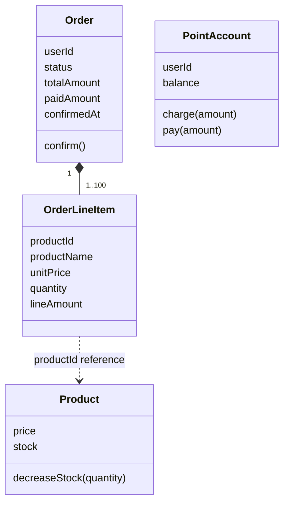

# 포인트·주문 설계 인터뷰

상태: 2026-09-18 인터뷰 Q1–Q23 답변을 반영하고, 사용자의 to-spec 요청에 따라 [구현 명세 Issue #11](https://github.com/giwankim/loop-pack-be-l2-vol5-kotlin/issues/11)을 ready-for-agent로 게시했다. 포인트 이력은 채택하되 구현 복잡도가 커지면 재검토한다. 동시 실행의 race condition 처리(Q8)와 DB migration 검토(Q23)는 사용자의 지시로 이번 단계에서 보류했다. 물리 FK(Q21), 주문·충전 이력을 활용한 성공 응답 재생(Q22)은 확정 사항이다. 아래 클래스·저장 구조·응답 필드 초안을 게시 명세에 정리했으며, 애플리케이션 코드는 이 인터뷰에서 변경하지 않았다.

## 1. 근거와 범위

- 과제: [2주차 실습 · 직접 설계하고 AI와 기본 기능 구현하기](https://app.notion.com/p/2-AI-3d85f76d265480e1ad80dc9dfb8aef4f). 2026-09-18에 사용자가 지정한 브라우저 탭에서 본문을 읽었다.
- 용어: [CONTEXT.md](../../CONTEXT.md).
- 기존 설계: [카탈로그 설계](./catalog.md), [카탈로그 도메인](../domain/catalog.md), [ADR 0001](../adr/0001-soft-delete-catalog-hard-delete-like.md).
- [1주차 주문 할인 계약](../week1/order-discount-contract.md)은 쿠폰 장면의 설계 기록이다. 2주차 기본 기능 목록에 쿠폰 API는 없고, Q1에서 이번 구현 범위에서 제외했다.
- 가격 보존 정책: [ADR 0002](../adr/0002-preserve-order-creation-price.md).
- 애그리거트와 트랜잭션 경계: [ADR 0003](../adr/0003-confirm-order-in-one-transaction.md).
- 성공 응답 재생과 업무 기록의 보존: [ADR 0004](../adr/0004-replay-success-from-business-records.md).

과제에 명시된 내용, 인터뷰에서 선택한 정책, 구현을 위한 구체화 초안을 구분한다. 보류한 항목을 권장안 채택으로 해석하지 않는다.

## 2. 과제에서 확인한 요구

| 기능 | API | 명시된 계약 |
| --- | --- | --- |
| 내 포인트 충전 | `POST /api/v1/points/charge` | `amount`를 잔액에 더해 저장하고 충전 후 잔액을 반환한다. |
| 내 잔액 조회 | `GET /api/v1/points` | 요청자로 식별한 사용자의 저장된 잔액을 조회한다. |
| 주문 생성 | `POST /api/v1/orders` | 여러 품목·수량·단가·합계를 `DRAFT`로 저장한다. 생성 시 차감하지 않는다. |
| 주문 확정 | `POST /api/v1/orders/{orderId}/confirm` | 본인의 `DRAFT` 주문에 대해 재고·포인트를 차감하고 결제액·결과를 저장한 뒤 `CONFIRMED`로 바꾼다. |
| 내 주문 목록·상세 | `GET /api/v1/orders`, `GET /api/v1/orders/{orderId}` | 내 주문의 품목·수량·금액·상태·결제액을 조회한다. |
| 관리자 주문 목록·상세 | `GET /api-admin/v1/orders`, `GET /api-admin/v1/orders/{orderId}` | 구매자별 주문의 품목·상태·금액·결제 결과를 조회한다. |

함께 지킬 조건:

- 1포인트는 1원이다. 충전액은 양의 정수이며 누락·잘못된 타입·표현 범위 초과를 거절한다.
- 잔액 0원을 허용한다. 충전 합산 범위를 확인하며 입력 오류로 기존 값이 바뀌지 않는다.
- 주문 생성·확정 모두 상품의 존재·삭제 여부와 양수 수량을 확인한다. 확정 시 재고나 잔액이 부족하면 거절한다.
- 중복 상품 품목은 합산하거나 거절한다. 합산한다면 총수량으로 재고를 판단한다. 어느 쪽인지는 과제가 정하지 않았다.
- 삭제된 브랜드·상품은 새 주문에서 제외한다. 상품이 삭제돼도 저장된 주문 정보가 함께 사라지지 않아야 한다.
- 실습용 사용자는 fixture로 준비할 수 있다. 사용자 식별 누락·없는 사용자를 거절하고 자기 포인트·주문만 다룬다.
- 관리자 요청의 접근 경계를 실제 controller·application·repository와 테스트 DB를 쓰는 HTTP 테스트에서 확인한다.
- 연결 검증: 잔액 0원에서 10,000원을 충전하고 여러 품목 합계 7,000원을 결제한 뒤, 주문 조회와 잔액 3,000원을 확인한다.
- 저장 검증은 JPA `flush/clear` 후 재조회한다. 대표 규칙 하나는 TDD를 적용하고 관련 테스트·lint·ArchUnit을 실행한다.

## 3. 현재 저장소와 연결되는 지점

2026-09-18 소스와 문서 확인 기준이며, 이번 인터뷰에서 실행 검증한 결과는 아니다.

- 현재 제품 코드에는 브랜드·상품·사용자·좋아요가 구현되어 있다. 초기 조사 이후 사용자·좋아요가 추가된 것을 다시 확인했다. 포인트·주문 구현은 아직 없다.
- `Money`는 0 이상인 `Long` 금액이며 덧셈·곱셈의 넘침과 음수가 되는 뺄셈을 거절한다. Q13에서 포인트·주문에도 이 표현 범위를 사용하기로 했다.
- `Product`는 상품 가격과 `Stock`을 소유한다. 현재 재고 변경은 최종 수량 설정이고 주문을 위한 차감 행위는 아직 없다.
- 카탈로그 설계 5.1의 단일 애그리거트 변경 원칙은 Q7과 ADR 0003에 따라 카탈로그 변경 범위로 한정했다. 주문 확정에서는 application이 여러 애그리거트를 하나의 트랜잭션으로 조율한다. `domainSlicesOnlyReadEachOther`는 domain 사이의 호출을 검사하며 application의 트랜잭션 범위를 직접 강제하지 않는다.
- 카탈로그 설계 5.3은 재고를 `Product` 안의 값 객체로 두었고, 독립된 재고 잠금이 필요할 때 별도 엔티티를 다시 검토하도록 했다.
- ADR 0001과 엔티티의 `@SQLRestriction`은 삭제된 상품·브랜드를 조회에서 숨긴다. Q2·Q10·Q14에 따라 OrderLineItem은 `productId`를 가지고 생성 당시 이름·단가·수량 등은 스냅샷에서 읽는다.
- 기존 사용자 식별 계약은 `X-USER-ID`다. [UserIdHeader](../../apps/commerce-api/src/main/kotlin/com/loopers/interfaces/api/UserIdHeader.kt)가 누락을 401로 처리하고, [LikeService](../../apps/commerce-api/src/main/kotlin/com/loopers/application/like/LikeService.kt)가 `UserRepository.existsById`로 존재를 확인한다. 이 경계를 재사용한다. 관리자 경계는 카탈로그 설계의 테스트 지원 설정을 따른다.
- 기존 `Stock.quantity`는 0 이상의 `Int`다. 상품 가격의 10억 원 상한은 Product만의 규칙이므로 포인트 잔액이나 주문 합계에 자동 적용하지 않는다.
- 현재 [JacksonConfig](../../supports/jackson/src/main/kotlin/com/loopers/config/jackson/JacksonConfig.kt)는 `ACCEPT_SINGLE_VALUE_AS_ARRAY`를 켜고, 숫자 소수부·문자열의 정수 변환을 막는 명시적 설정은 두지 않았다. Q20에 따라 새 API의 요청 경계에서 엄격히 검사하고 전역 설정은 바꾸지 않는다. `Long`·`Int`와 최솟값 제약만으로 충분하다고 간주하지 않는다.
- 기존 목록 계약은 `items/page/size/hasNext`, 0부터 시작하는 page, 기본 size 20·최대 100, 최신순의 `createdAt DESC, id DESC`다. Q19에서 주문에도 재사용하기로 했다.
- [jpa.yml](../../modules/jpa/src/main/resources/jpa.yml)은 기본 `ddl-auto=none`, local/test는 `create`다. Q23에서 DB migration 검토를 보류했으므로 도구 도입이나 기존 DB 전환을 이번 설계의 선행 조건으로 두지 않는다. 새 FK의 실제 생성·검증에 필요한 최소 초기화는 구현 시 다룬다.
- [ErrorType](../../apps/commerce-api/src/main/kotlin/com/loopers/support/error/ErrorType.kt)은 HTTP status와 문자열 code를 이미 분리한다. 새 업무 코드를 추가하되 기존 항목의 code는 보존한다. 실제 응답 필드 이름은 [ApiResponse](../../apps/commerce-api/src/main/kotlin/com/loopers/interfaces/api/ApiResponse.kt)의 `meta.errorCode`다.

## 4. 결정 트리

Q1–Q23은 답변을 받았다. Q8의 경합 처리와 Q23의 DB migration은 사용자의 지시로 보류했다. 잠금 방식·동시 재요청 복구·migration 도구 선택을 추가 인터뷰 질문으로 이어 가지 않는다. 현재 범위에서 남은 업무 정책 질문은 없으며, 11절에 전체 설계와 명세 게시 결과를 정리했다.

| ID | 결정한 것 | 사용자의 선택 | 후속 결정 |
| --- | --- | --- | --- |
| Q1 | 이번 조각의 기능 범위 | 위 고객·관리자 API와 필요한 사용자 fixture를 포함한다. 쿠폰·취소·환불·만료·예약·외부 결제는 이번 조각에서 제외한다. | 사용자 준비 방식, 목록·상세 계약 |
| Q2 | DRAFT에 저장된 단가의 효력 | 생성 시 상품 가격으로 단가를 기록하고 확정에도 그대로 쓴다. 가격 변경 시 확정 거절 대안도 비교했으며 결정은 ADR 0002에 명시한다. | Q10에서 이름 등 스냅샷 범위도 확정 |
| Q3 | 같은 상품이 요청에 여러 번 있을 때의 의미 | 상품별 수량을 합산해 한 품목으로 기록한다. | Q13에서 수량·입력 품목 수와 넘침 거절도 확정 |
| Q4 | 여러 품목 중 하나라도 확정에 실패했을 때의 결과 | 해당 확정 시도의 차감을 모두 취소하고 주문은 DRAFT로 유지한다. 같은 주문으로 재시도할 수 있다. | 트랜잭션 경계(Q7), 동시성(Q8), 실패 기록(Q11) |
| Q5 | 이미 확정한 주문의 확정 재요청 | 저장된 성공 결과를 반환하고 추가 차감하지 않는다. | 응답 필드(Q19), 충전·생성의 키 계약(Q15–Q16). 동시 확정은 연기 |
| Q6 | 포인트 변경 사유를 남길 필요 | 현재 잔액과 충전·결제 이력을 함께 저장한다. 구현 복잡도가 커지면 재검토할 수 있다. | 최소 기록 범위(Q11), 잔액과 이력의 일관성 |

| ID | 선행 결정 | 2차 질문 | 사용자의 선택 |
| --- | --- | --- | --- |
| Q7 | Q4, Q6 | 주문·포인트·재고의 책임과 원자적 확정의 구현 경계 | Order(품목 포함), 사용자별 PointAccount, Product(Stock 포함)를 분리하고 application이 하나의 DB 트랜잭션에서 확정을 조율한다. 생성과 확정의 변경 대상을 구분해 설명한다(5.5, ADR 0003). |
| Q8 | Q4, Q5, Q6 | 동시 실행의 경합 처리 | 이번에는 다루지 않는다. 단일 요청의 원자성과 순차 재요청의 멱등성은 유지한다. |
| Q9 | Q1, Q5 | 충전·주문 생성의 요청 식별자 전달 | 헤더 Idempotency-Key를 사용한다. 자세한 키 범위·실패·응답 재생 규칙은 Q15–Q16에서 정한다. |
| Q10 | Q2, Q1 | 주문 품목 이름과 스냅샷 | OrderLineItem이 상품 참조와 생성 당시 이름·단가 등 스냅샷을 가진다. 상품 ID·수량·품목 합계·주문 합계도 보존하며 기본 주문 조회에서 브랜드는 제외한다. |
| Q11 | Q4, Q6 | 포인트 이력과 실패한 확정 시도 | 성공해서 잔액이 바뀐 기록만 저장한다. 실패 시도는 별도 업무 이력으로 저장하지 않는다. |
| Q12 | Q1, Q4 | 재고나 포인트가 부족한 상태의 DRAFT 생성 | 허용한다. 생성 때는 상품 유효성·양수 수량·금액 범위를 검사하고, 재고·잔액 부족은 확정 때 거절한다. |
| Q13 | Q1, Q3 | 충전액·잔액·품목 수·수량의 입력 한도 | 기존 Money의 Long 범위, 상품별 합산 수량은 양의 Int 범위, 합산 전 입력 품목은 1–100개다. 별도 금액 업무 상한은 두지 않으며 넘침은 거절한다. |

| ID | 선행 결정 | 3차 질문 | 사용자의 선택 |
| --- | --- | --- | --- |
| Q14 | Q7, Q10 | OrderLineItem의 상품 참조 형태 | productId 참조와 스냅샷을 함께 둔다. Product 객체 연관은 두지 않는다. Q21에서 물리 FK도 적용하기로 했다. |
| Q15 | Q9 | Idempotency-Key의 적용·비교·보관 규칙 | 충전·생성에 필수이고 확정은 orderId로 식별한다. 키 범위는 사용자+작업 종류이며 1–128자 영문·숫자·하이픈·밑줄 문자열을 받는다. 같은 키로 다른 의도를 보내면 409, 합산·정렬한 상품별 수량이 같으면 같은 주문 의도로 본다. 성공한 키만 기록하고 이번에는 만료를 두지 않는다. |
| Q16 | Q5, Q9 | 충전·생성 성공 재요청의 응답 내용 | 첫 성공의 HTTP status와 업무 응답을 재생한다. 충전 당시 잔액과 최초 DRAFT 응답을 보관하며 현재 상태는 GET으로 조회한다. |
| Q17 | Q1, Q7 | 사용자 fixture와 포인트 계정의 초기 상태 | 사용자 fixture를 준비할 때 잔액 0인 계정을 함께 만든다. 조회나 첫 주문이 계정을 생성하지 않는다. |
| Q18 | Q4, Q9 | 소유권·입력·업무 거절의 오류 계약 | 식별 누락·미존재 사용자는 401, 없거나 남의 주문은 404, 입력 오류는 400, 재고·잔액 부족과 키 내용 충돌은 409. 기존 응답 모양을 유지하고 포인트·주문의 업무 오류는 구별 가능한 meta.errorCode를 부여한다. |
| Q19 | Q1, Q5, Q10 | 주문 조회·성공 응답 계약 | 생성 201, 확정·조회 200. 기존 Slice 형태·page/size·최신순을 사용하고 목록·상세에 품목을 포함한다. 관리자는 userId로 필터 가능하다. DRAFT에는 paidAmount·confirmedAt을 생략하고 CONFIRMED에는 저장된 값을 제공한다. |
| Q20 | Q3, Q13 | JSON 정수와 품목 배열의 허용 표현 | 금액·수량에는 정수 표기의 JSON 숫자만 허용하고 숫자 문자열·소수·지수 표기는 거절한다. items는 배열만 허용한다. 기존 카탈로그의 전역 바인딩 계약은 변경하지 않는다. |

| ID | 선행 결정 | 4차 질문 | 사용자의 선택 |
| --- | --- | --- | --- |
| Q21 | Q14, 현재 스키마 설정 조사 완료 | 새 애그리거트 사이의 식별자 참조에 물리 FK도 둘 것인가? | 물리 FK 제약을 적용한다. productId 스칼라 참조는 유지한다. 애플리케이션의 존재 검사만 두자는 권장안은 선택하지 않았다. DB migration 검토는 Q23에서 보류했다. |
| Q22 | Q6, Q15, Q16 | 첫 성공 응답을 어디에 보관할 것인가? | 권장안을 채택했다. 별도 범용 응답 저장 테이블 대신 주문의 불변 생성 정보와 충전 이력을 사용한다. 충전 이력에 키·충전액·당시 잔액, 주문에 생성 키를 저장한다. 이력을 나중에 줄이더라도 충전 재생에 필요한 기록은 유지한다. |

| ID | 선행 결정 | 5차 질문 | 사용자의 선택 |
| --- | --- | --- | --- |
| Q23 | Q21, 현재 초기화·의존성 조사 완료 | FK를 포함한 스키마를 어떻게 관리할 것인가? | DB migration은 지금 다루지 않는다. Flyway나 전체 schema SQL 전환은 채택하지 않았으며, 이 선택을 구현 착수의 선행 조건으로 두지 않는다. Q21의 물리 FK 요구는 유지한다. |

동시성 전략·DB migration 검토·예약·만료 정책은 이번 설계 범위에 추가하지 않는다.

## 5. 결정 기록

### 5.1 범위와 가격 보존 — Q1, Q2

- 필수 고객·관리자 API와 사용자 fixture를 이번 범위로 확정했다. 취소·환불·만료·예약·쿠폰·외부 결제는 포함하지 않는다.
- 주문 생성 시 서버가 상품 가격을 단가로 기록하고 이후 가격 변경을 확정 거절 사유로 삼지 않는다. 단가 × 수량의 품목 금액과 그 합계로 주문 금액을 보존한다.
- 사용자가 직접 제시한 대안은 현재 가격과 다르면 검증 실패로 거절하는 방식이다. 이번에는 생성 시 가격을 사용하며 [ADR 0002](../adr/0002-preserve-order-creation-price.md)에 선택과 대가를 남겼다.
- 가격 상승·하락 모두 같은 정책이다. 생성 시 10,000원이면 이후 12,000원이나 8,000원이 되어도 10,000원을 사용한다. 주문 만료가 없는 현재 범위에서는 오래된 DRAFT에도 적용된다.
- 가격 보존은 재고 예약이 아니다. 상품 삭제·재고 부족·잔액 부족은 여전히 확정을 거절할 수 있다.
- Q10에서 이름 등의 스냅샷 보존과 상품 참조를 함께 채택했다. 주문 품목의 정식 이름은 사용자가 선택한 OrderLineItem이다.

### 5.2 중복 품목 합산 — Q3

- 같은 상품의 입력 수량을 합산해 하나의 주문 품목으로 기록한다. A 2개와 A 3개는 A 5개다.
- 과제의 양수 수량 조건은 각 입력 품목에 적용된다. 음수나 0인 입력을 합산으로 감추지 않는다.
- 확정 시 재고 검사는 합산한 상품별 총수량을 기준으로 한다. Q13에 따라 합산 전 입력은 1–100개이며 상품별 수량 합산이 Int 범위를 넘으면 거절한다.

### 5.3 확정 실패와 재요청 — Q4, Q5

- 첫 확정 시도는 모든 품목의 재고 차감, 포인트 차감, 결제 성공 기록, 주문의 CONFIRMED 전환이 함께 성공하거나 함께 실패해야 한다.
- B 재고 부족으로 확정에 실패하면 A의 재고도 차감되지 않고 잔액·결제 성공 이력도 변하지 않는다. 주문은 삭제되거나 실패 종결 상태가 되지 않고 DRAFT로 남는다.
- 재입고나 충전 후 같은 주문을 다시 확정할 수 있다.
- 이미 CONFIRMED인 본인 주문의 확정 재요청은 저장된 성공 결과를 반환한다. 재고·포인트를 다시 차감하거나 결제 성공 이력을 추가하지 않는다.
- Q8의 사용자 지시에 따라 이번 검증은 단일 요청과 순차 재요청을 대상으로 한다. 동시 요청의 이중 차감·초과 판매·충전 유실 방지는 후속 과제이며, 트랜잭션만으로 경합까지 해결됐다고 간주하지 않는다. 이전 권장안인 대기 후 최신 상태 판단은 채택되지 않았다.
- 이때 현재 상품의 가격·삭제 여부나 현재 잔액으로 완료된 결제의 성공을 뒤집지 않는다. 요청자 식별과 주문 소유권 확인은 재요청에서도 필요하다.
- 충전과 주문 생성은 Q9·Q15·Q16에 따라 Idempotency-Key 헤더로 요청을 구분하고 첫 성공 결과를 재생한다(5.8).

### 5.4 포인트 이력의 조건부 채택 — Q6

- 현재 잔액과 충전·결제 이력을 함께 저장한다.
- 사용자는 구현 복잡도가 커지면 이 결정을 재검토할 수 있다고 명시했다. 아직 이력을 제거하거나 미구현으로 미룬 결정은 아니다.
- Q11에서 성공해서 잔액이 바뀐 기록만 저장하기로 했다. 충전·결제가 실패하거나 성공 요청을 다시 재생할 때는 포인트 이력을 추가하지 않는다. 이 결정을 이벤트 소싱이나 복식부기 채택으로 해석하지 않는다.
- 재검토 시에는 실제 늘어난 저장·트랜잭션·검증 비용과 이력을 생략할 때 잃는 추적 정보를 제시하고, 사용자의 새 선택을 기록한다. 검증 실패를 피하려고 조용히 이력을 빼지 않는다.

### 5.5 생성·확정의 변경 대상 — Q7

테이블 수나 읽은 엔티티 수는 변경한 애그리거트 수와 같지 않다. OrderLineItem은 Order의 구성원이고 상품 참조는 상품을 변경할 권한을 뜻하지 않는다.

| 유스케이스 | 읽거나 검사하는 대상 | 변경하는 도메인 상태 | 같은 성공에 딸린 기록 |
| --- | --- | --- | --- |
| DRAFT 생성 | 사용자, 상품·브랜드의 유효성, 현재 상품 이름·가격 | Order와 그 OrderLineItem 생성 | 멱등성 성공 결과 |
| 주문 확정 | 요청자·소유권, 주문 상태, 상품 유효성, 재고·잔액 | Order, PointAccount, 해당 품목의 각 Product | 성공한 포인트 결제 이력 |
| 포인트 충전 | 사용자, 충전 입력, 기존 잔액 | PointAccount | 성공한 충전 이력, 멱등성 성공 결과 |

application이 각각의 저장소와 애그리거트 행동을 조율한다. Order에서 Product나 PointAccount를 직접 변경하지 않는다. 기록을 저장하는 테이블이 있다고 해서 모두 독립된 도메인 애그리거트로 분류하지 않는다. 상세 모델 초안은 7절이며 원자적 변경에 대한 결정은 ADR 0003이다.

### 5.6 OrderLineItem의 스냅샷 — Q10

- OrderLineItem은 Order 안의 구성원으로 상품 참조와 생성 당시 상품 이름·단가, 수량·품목 금액을 가진다. 주문 전체 합계는 Order에 속한다.
- 상품 이름·가격을 수정하거나 상품을 삭제해도 과거 주문 정보는 스냅샷에서 읽는다. 참조가 가리키는 현재 상품을 다시 읽어서 과거 정보를 채우지 않는다.
- Q14에서 `productId` 식별자 참조를 선택했다. Product 객체 연관을 두지 않으며, 현재 상품이 필요한 생성·확정에서만 application이 상품을 조회한다. Q21에 따라 이 식별자 참조에 물리 DB 외래 키도 적용한다.
- 브랜드 정보는 기본 주문 조회에 포함하지 않는다.

### 5.7 DRAFT 생성과 범위 — Q12, Q13

- 재고가 0이거나 포인트 잔액이 주문 금액보다 작아도 DRAFT를 만들 수 있다. 상품 유효성·양수 수량·금액 범위 조건은 그대로 검사한다.
- 각 충전액은 1..Long.MAX_VALUE이며 충전 후 잔액도 Long.MAX_VALUE를 넘을 수 없다. 잔액은 0을 허용한다.
- 주문 입력 품목은 합산 전에 1..100개다. 입력 수량과 상품별 합산 수량은 1..Int.MAX_VALUE이고, 품목 금액·주문 합계도 Long 범위를 넘으면 거절한다.
- 클라이언트가 보낸 단가나 합계를 신뢰하지 않고 서버가 상품 가격과 수량으로 계산한다. Q20에 따라 정수 표기의 JSON 숫자만 받는다(5.10).

### 5.8 키와 첫 성공 응답 — Q9, Q15, Q16

- 충전과 주문 생성에는 `Idempotency-Key`가 필수다. 확정은 `orderId`로 식별하며 별도 키를 요구하지 않는다.
- 키는 `[A-Za-z0-9_-]{1,128}`이다. 공백 제거·대소문자 통합을 하지 않는다. `Charge-A`와 `charge-a`는 다르다. 저장·조회·유일 제약도 이 비교 의미를 보존해야 한다.
- 범위는 `(사용자, 작업 종류, 키)`다. 다른 사용자의 같은 키나 같은 사용자의 충전·생성에 사용한 같은 키는 충돌하지 않는다.
- 충전의 의도는 충전액이다. 주문 생성의 의도는 상품별 수량을 합산하고 `productId` 순으로 정렬한 목록이다. A 2개 + A 3개와 A 5개는 같다. 상품의 현재 이름·가격은 의도 비교에 넣지 않는다.
- 각 원본 품목의 양수 수량, 합산 전 1–100개, 숫자 범위·넘침은 정규화 전에 검사한다. 유효하지 않은 요청을 정규화로 유효하게 바꾸지 않는다.
- 성공한 같은 키·같은 의도는 첫 성공의 HTTP status와 업무 응답을 반환한다. 다른 의도는 409다. 현재 상품 가격·판매 가능 여부를 검사하기 전에 성공 기록을 찾으므로, 성공 뒤 상품이 바뀌거나 삭제돼도 원래 응답을 재생한다.
- 충전 후 결제했더라도 충전 재요청은 충전 당시 잔액이다. 생성한 주문을 확정했더라도 생성 재요청은 최초 DRAFT 응답이다. 현재 잔액·주문 상태는 GET으로 조회한다.
- 실패한 요청은 키를 소비하지 않는다. 같은 키로 잘못된 입력을 고치거나 충전·재입고 후 재시도할 수 있다. 키와 성공 결과를 저장하는 트랜잭션이 실패하면 업무 변경도 함께 롤백한다.
- 성공 기록은 이번 범위에서 만료·정리하지 않는다. Q22에 따라 주문·충전 이력을 사용한다(8.3, ADR 0004). 응답 재생은 같은 HTTP status와 JSON 업무 필드 값을 뜻하며 네트워크 전송 헤더나 JSON 공백까지 보존하는 요구는 아니다.
- 인증·소유권 확인은 재요청에서도 생략하지 않는다. 성공 기록을 다른 사용자에게 노출하지 않는다.

### 5.9 초기 계정·오류·조회 — Q17, Q18, Q19

- 사용자 fixture를 준비할 때 잔액 0인 PointAccount를 함께 만든다. 기존 User를 재사용하며 사용자 생성 API는 추가하지 않는다. 잔액 조회·주문 생성이 계정을 뒤늦게 만들지 않는다.
- 기존 `UserIdHeader`의 누락 401과 application의 사용자 존재 검사를 재사용한다. 없는 주문과 타인의 주문은 같은 404로 응답한다.
- 재고·잔액 부족, 같은 키의 다른 의도는 409다. 입력 오류는 400이다. 새로운 포인트·주문 업무 오류에 구분 가능한 `meta.errorCode`를 주되 기존 카탈로그 코드 문자열은 바꾸지 않는다.
- 생성 성공은 201, 확정·조회는 200이다. 목록은 기존 Slice 응답과 최신순을 사용한다. 고객은 자기 주문만 조회하고, 관리자는 전체 또는 `userId`로 필터한다.
- 목록·상세 모두 스냅샷 품목을 포함한다. DRAFT에는 `paidAmount`와 `confirmedAt`이 없고 CONFIRMED에는 저장된 값이 있다.

### 5.10 엄격한 JSON 입력 — Q20

| 입력 | 결과 |
| --- | --- |
| `"amount": 1000` | 허용. 양수·Long 범위·충전 후 잔액 범위도 검사한다. |
| `"amount": "1000"` | 400. 숫자 문자열을 변환하지 않는다. |
| `"amount": 1000.0` 또는 `"amount": 1e3` | 400. 값이 정수와 같아도 소수·지수 표기는 받지 않는다. |
| 숫자 필드 누락·null·boolean·객체·배열 | 400. 기본값 0으로 대체하지 않는다. |
| `"items": [{"productId": 10, "quantity": 2}]` | 배열로 처리하고 각 품목을 검증한다. |
| `"items": {"productId": 10, "quantity": 2}` | 400. 한 품목 배열로 자동 변환하지 않는다. |

수량은 같은 정수 표기 정책과 Int 범위를 사용한다. 새 JSON 요청의 상품 식별자도 양의 Long 정수로 바인딩하는 초안이다. HTTP 경계의 전용 입력 DTO/역직렬화로 숫자 토큰의 종류와 배열 형태를 확인한 뒤 application Request로 옮긴다. 전역 ObjectMapper 설정과 기존 카탈로그 바인딩은 유지한다. 알 수 없는 JSON 필드는 기존 설정대로 무시하되 입력의 가격·합계는 사용하지 않는다.

## 6. API 입력·응답 초안

상태 코드·조회 범위·페이지 계약은 확정 사항이다. 아래 필드 이름과 응답 조합은 그 계약을 구체화한 초안이다. 응답은 기존 `ApiResponse`를 사용하며 null 필드는 기존 Jackson 정책에 따라 생략한다.

| 요청 | 필수 입력 | 성공 data |
| --- | --- | --- |
| `POST /api/v1/points/charge` | X-USER-ID, Idempotency-Key, `amount` | `balance` — 해당 충전 직후 잔액. 200 제안 |
| `GET /api/v1/points` | X-USER-ID | `balance` — 현재 잔액 |
| `POST /api/v1/orders` | X-USER-ID, Idempotency-Key, `items` | 아래 주문 응답. 최초 DRAFT |
| `POST /api/v1/orders/{orderId}/confirm` | X-USER-ID, 경로 orderId | 아래 주문 응답. 저장된 CONFIRMED |
| `GET /api/v1/orders` | X-USER-ID, 선택 page/size | `items: [주문 응답], page, size, hasNext` |
| `GET /api/v1/orders/{orderId}` | X-USER-ID, 경로 orderId | 현재 주문 응답 |
| `GET /api-admin/v1/orders` | 관리자 자격, 선택 userId/page/size | 주문 목록. 각 주문에 구매자 userId 포함 |
| `GET /api-admin/v1/orders/{orderId}` | 관리자 자격, 경로 orderId | 주문 응답과 구매자 userId |

현재 User는 식별자만 가진 실습 데이터이므로 구매자 이름·연락처를 새로 만들지 않는다. `page >= 0`, `1 <= size <= 100`, 기본 size 20이며 범위를 벗어나면 400이다. 별도 정렬 옵션은 추가하지 않는다. 품목은 productId 오름차순으로 응답하는 초안이다.

```http
POST /api/v1/points/charge
X-USER-ID: 1
Idempotency-Key: charge-001
Content-Type: application/json

{"amount":10000}
```

```json
{"meta":{"result":"SUCCESS"},"data":{"balance":10000}}
```

상품 10의 가격이 2,000원, 상품 20의 가격이 3,000원인 예다. 다음 생성은 201이며 잔액과 재고를 차감하지 않는다.

```http
POST /api/v1/orders
X-USER-ID: 1
Idempotency-Key: order-001
Content-Type: application/json

{"items":[{"productId":10,"quantity":2},{"productId":20,"quantity":1}]}
```

```json
{
  "meta": {"result": "SUCCESS"},
  "data": {
    "orderId": 101,
    "status": "DRAFT",
    "items": [
      {"productId": 10, "productName": "상품 A", "unitPrice": 2000, "quantity": 2, "lineAmount": 4000},
      {"productId": 20, "productName": "상품 B", "unitPrice": 3000, "quantity": 1, "lineAmount": 3000}
    ],
    "totalAmount": 7000,
    "createdAt": "2026-09-18T01:00:00Z"
  }
}
```

확정 응답은 위 값에 `status: CONFIRMED`, `paidAmount: 7000`, 저장된 `confirmedAt`을 반영한다. 확정 응답에는 현재 잔액을 포함하지 않는 초안이다. 이후 잔액 GET은 3,000원이지만 charge-001 재요청 응답은 10,000원이며 order-001 재요청 응답은 위의 DRAFT다.

오류 이름의 구체화 초안:

| 상황 | HTTP | meta.errorCode |
| --- | --- | --- |
| 요청자 헤더 누락·없는 사용자 | 401 | 기존 `Unauthorized` 유지 |
| 없거나 타인의 주문 | 404 | `ORDER_NOT_FOUND` |
| 새 생성·첫 확정 대상 상품이 없거나 삭제됨 | 404 | `ORDER_PRODUCT_NOT_AVAILABLE` |
| 키 누락·형식 오류 | 400 | `INVALID_IDEMPOTENCY_KEY` |
| 새 요청의 JSON 형태·필수 값·수량·금액 범위 오류 | 400 | `INVALID_POINT_ORDER_REQUEST` |
| 재고 부족 | 409 | `INSUFFICIENT_STOCK` |
| 포인트 부족 | 409 | `INSUFFICIENT_POINTS` |
| 성공한 같은 키에 다른 의도 | 409 | `IDEMPOTENCY_KEY_CONFLICT` |

```json
{"meta":{"result":"FAIL","errorCode":"INSUFFICIENT_POINTS","message":"포인트 잔액이 부족합니다."}}
```

domain의 부족 예외를 interfaces에서 구체적으로 매핑한다. 기존 `RuleViolationException`의 범용 400 매핑은 유지한다. 새 키 헤더의 누락도 의도적으로 400으로 변환해 프레임워크 예외가 범용 500으로 빠지지 않도록 한다. 사용자와 계정을 함께 준비하기로 했는데 계정만 없는 경우는 입력 오류가 아니라 내부 데이터 불일치로 처리한다.

## 7. 클래스와 책임 초안

기존 layer-first 패키지를 유지한다. `domain/{기능}`, `application/{기능}`, `infrastructure/{기능}`, `interfaces/api/v1/{기능}`을 사용한다. 새로운 domain Service나 전체 패키지 재배치는 필요하지 않다.



다이어그램의 Product 화살표는 객체 연관이 아닌 식별자 참조다. Q21에 따라 DB에서는 물리 FK도 둔다. 여러 애그리거트를 변경하는 호출자는 application의 OrderService다.

| 구성요소 | 소유 상태·행동 | 경계 |
| --- | --- | --- |
| Order | 사용자 식별자, 품목, DRAFT/CONFIRMED, 합계, 결제액·확정 시각. 생성 시 총액 계산, 확정 시 상태·결제 결과 변경 | 다른 애그리거트의 상태를 변경하지 않는다. 품목은 생성 뒤 수정하지 않는다. |
| OrderLineItem | productId, 생성 당시 이름·단가, 양수 수량, 품목 금액 | Order의 내부 엔티티로 제안한다. 외부에서 단독 수정·삭제하지 않는다. |
| PointAccount | 사용자 식별자, 잔액. `charge`와 `pay`가 금액·잔액 규칙 보장 | 0원 충전·결제를 거절한다. 잔액 부족은 전용 예외로 표현한다. |
| PointHistory | 성공 종류 CHARGE/PAYMENT, 양의 금액, 변경 후 잔액, 시각, 연결 주문 | 추가 후 바꾸지 않는 기록이다. 별도 가변 애그리거트나 모든 이력을 담는 계정 컬렉션으로 만들 필요는 없다. |
| Product / Stock | 기존 가격·재고. 양수 수량을 받아 재고 부족을 검사하고 차감 | 기존 관리자 재고 설정과 고객 주문 차감을 구분한다. |
| Money | 기존 Long 금액·검사된 연산 | Money는 0을 허용하므로 충전액·수량의 양수 조건은 해당 행위에서 별도 검사한다. |
| PointService | 사용자·계정 조회, 충전 재요청 판별, 잔액 변경과 이력 저장 | 충전과 그 성공 기록을 하나의 트랜잭션으로 묶는다. |
| OrderService | 생성 의도 정규화, 상품 스냅샷 생성, 재요청 판별, 확정 조율 | 확정에서 각 domain 저장소와 행동을 직접 조율한다. PointService를 호출해 별도 커밋하지 않는다. |
| 조회 application | 소유권·페이지 조건, 저장된 주문·품목 조회, Info 생성 | 트랜잭션 안에서 필요한 데이터를 읽고 엔티티를 HTTP까지 노출하지 않는다. |
| domain 저장소 포트 / infrastructure 구현 | 기존 저장소 구성과 같은 방향으로 저장·검색 | infrastructure가 application Info를 참조하지 않도록 한다. |
| 새 HTTP 입력 DTO·응답 DTO | 엄격한 JSON 검증, 헤더·경로 바인딩, ApiResponse 변환 | application Request/Info와 domain에 Jackson 입력 정책·HTTP status를 넣지 않는다. |

상태 불변식:

- `totalAmount = sum(lineAmount)`, `lineAmount = unitPrice × quantity`. 모든 계산은 범위 초과를 검사한다.
- 한 주문 안의 productId는 유일하며 생성 뒤 상품 이름·단가·수량·금액을 바꾸지 않는다.
- DRAFT의 paidAmount·confirmedAt은 없다. CONFIRMED에는 둘 다 있고, 이번 범위에서는 `paidAmount = totalAmount`다.
- 별도 Payment 애그리거트는 두지 않는 초안이다. Order의 확정 상태·결제액·시각과 성공 포인트 이력으로 이번 결제 결과를 표현한다.
- 사용자별 계정 하나와 잔액 0 이상을 지킨다. 이력은 잔액을 변경한 같은 트랜잭션에서만 추가한다.

## 8. 저장 구조 초안과 보류 사항

### 8.1 기본 구조

아래는 실행 가능한 migration이 아니라 모델과 필요한 제약의 초안이다. BaseEntity의 ID·시간 필드를 재사용하되 주문·계정·이력을 삭제하는 유스케이스는 이번 범위에 없다. 카탈로그의 논리 삭제 정책을 새 엔티티에 자동 확장하지 않는다.

| 테이블 | 주요 열 | 필요한 제약·조회 인덱스 |
| --- | --- | --- |
| 기존 users | id | 기존 User 유지 |
| point_account | id, user_id, balance(BIGINT) | user_id 유일, balance >= 0 |
| point_history | id, point_account_id, type, amount(BIGINT), balance_after(BIGINT), charge_key(nullable), order_id(nullable), created_at | amount > 0, balance_after >= 0. (point_account_id, charge_key) 유일. PAYMENT의 order_id 유일. CHARGE는 charge_key 필수·order_id 없음, PAYMENT는 order_id 필수·charge_key 없음 |
| commerce_order | id, user_id, creation_key, status, total_amount(BIGINT), paid_amount(nullable), confirmed_at(nullable), created_at | (user_id, creation_key) 유일. 사용자 목록용 (user_id, created_at, id), 전체 목록용 (created_at, id). 상태에 맞는 결제 필드 조건 |
| order_line_item | id, order_id, product_id, product_name, unit_price(BIGINT), quantity(INT), line_amount(BIGINT) | (order_id, product_id) 유일, 양수 단가·수량·품목 금액 |

포인트 이력은 append-only라는 도메인 규칙을 적용한다. FK·유일 제약이 있더라도 동시 요청 처리까지 완성됐다고 간주하지 않는다. 잠금·경합 복구는 Q8에 따라 제외한다.

Q21에 따라 적용할 FK:

| 참조 열 | 대상 |
| --- | --- |
| point_account.user_id | users.id |
| commerce_order.user_id | users.id |
| order_line_item.order_id | commerce_order.id |
| order_line_item.product_id | product.id |
| point_history.point_account_id | point_account.id |
| point_history.order_id | commerce_order.id — PAYMENT에 값이 있다 |

물리 삭제의 기본 동작은 RESTRICT로 제안한다. 상품 삭제는 기존 논리 삭제로 처리하므로 FK를 지키면서 과거 주문을 보존할 수 있다. 상품 삭제에 주문 품목을 연쇄 삭제하는 FK는 두지 않는다. FK는 행의 존재를 보장하며, 상품이 삭제되지 않았는지나 결제 이력의 계정과 주문 소유자가 같은지는 application에서 계속 검사한다.

키 열은 ASCII 대소문자를 구분하는 비교·유일 제약으로 만든다. 예를 들어 `VARCHAR(128) CHARACTER SET ascii COLLATE ascii_bin`을 사용할 수 있다. 문자열 허용 범위는 5.8의 입력 검사를 따른다. 실제 SQL 형태와 제약은 구현 시 확인하며 migration 도구 선택을 선행 조건으로 두지 않는다.

### 8.2 Q21 — 식별자 참조와 물리 FK

**확정: 스칼라 식별자 참조와 물리 FK를 함께 사용한다.** OrderLineItem이 Product 객체를 가지지 않아도 명시적 스키마에 FK를 둘 수 있다. Q21에서 사용자는 FK 제약 적용을 선택했다.

- 선택하지 않은 대안은 기존 Hibernate `create`를 유지하고 스칼라 참조의 존재를 application에서만 검사하는 방식이다. 구현 범위는 작지만 직접 SQL이나 다른 쓰기 경로의 잘못된 참조를 DB에서 거절하지 못한다.
- 실제 DB에서 위 FK가 생성되고 잘못된 참조를 거절하는지 구현 시 검증한다. Q14의 Product 객체 연관 없는 스칼라 참조를 유지한다. migration 도구 도입·기존 DB 전환 검토는 Q23에 따라 보류하고, 새 제약에 필요한 초기화는 구현 범위에서 작게 다룬다.

환경 조사에서 Hibernate 6.6.11.Final은 schema 생성 뒤 import SQL을 실행하지만, schema drop은 매핑에 없는 FK를 먼저 제거하지 않는 것으로 확인했다. MySQL의 테스트 데이터 정리 코드가 쓰는 FK 검사 해제는 EMF의 schema 재생성과 별개다. 따라서 `import.sql`에 FK 추가 한 줄을 넣는 것만으로 반복 `ddl-auto=create`까지 해결됐다고 제안하지 않는다. 이 판단은 설정·의존성 소스 확인이며 DB 재현 테스트 결과는 아니다. 관련 설정: [Hibernate schema tooling](https://docs.hibernate.org/orm/6.6/javadocs/org/hibernate/cfg/SchemaToolingSettings.html).

### 8.3 Q22 — 성공 응답의 저장 위치

**확정: 기존 업무 기록에 필요한 정보를 함께 보관한다.** Q22에서 권장안을 채택했다. 별도 범용 멱등성 테이블 없이 Q16의 재생 계약을 지킨다([ADR 0004](../adr/0004-replay-success-from-business-records.md)).

- CHARGE PointHistory에 `charge_key`를 추가한다. 충전 의도는 amount, 응답은 balance_after에서 재구성한다. `(point_account_id, charge_key)`를 유일하게 두고 PAYMENT의 charge_key는 null이다.
- Order에 `creation_key`를 추가하고 `(user_id, creation_key)`를 유일하게 둔다. 저장된 productId·quantity 목록이 생성 의도이며, 불변 스냅샷과 createdAt으로 최초 생성 응답을 재구성한다.
- 생성 응답용 매핑은 현재 Order.status를 그대로 쓰지 않는다. 이미 확정됐어도 DRAFT와 최초 필드만 제공한다. 현재 상태 조회·확정 응답 매핑과 역할을 구분한다.
- 충전과 주문은 서로 다른 저장 위치이므로 같은 사용자가 두 작업에 같은 키를 써도 된다. 키 열과 조회는 대소문자를 구분해야 하며 DB 기본 collation에 맡기지 않는다.
- HTTP status는 충전 200·생성 201인 고정 계약에서 정한다. 변경되는 updatedAt·현재 잔액·현재 상품 정보는 최초 주문 응답에 넣지 않는다.
- 응답에 담긴 시각은 DB 저장 정밀도와 일치시킨다. 첫 응답과 새 영속성 컨텍스트에서 읽은 재응답이 달라지지 않도록, 최초 저장의 flush/refresh 또는 명시적 정밀도 정규화를 구현 시 검증한다.
- Q6을 재검토해 전체 포인트 이력을 줄이더라도 성공 충전 키·amount·balance_after는 남겨야 한다. 재생용 최소 기록으로 옮길 수는 있지만, 성공 키를 잊고 다시 충전하게 만들어서는 안 된다.

**선택하지 않은 대안: 별도 멱등성 성공 기록을 둔다.** `(user_id, operation, key)`와 정규화된 의도, 최초 status·응답 데이터를 저장한다. 각 업무의 기록 형태와 분리할 수 있지만 새 테이블·저장 포트·응답 보존 형식이 필요하다. 이번에는 업무 기록을 활용해 그 추가 구성을 줄인다. 실패 시도나 진행 중 상태를 저장하는 시스템으로 범위를 확대하지 않는다.

### 8.4 Q23 — DB migration 검토 보류

사용자는 “do not worry about DB migration yet”이라고 답했다. 이에 따라 migration 도구 선택, 기존 테이블의 baseline 작성, 기존 데이터 전환·배포 절차는 이번 단계에서 다루지 않는다. 앞서 비교한 Flyway + validate와 전체 schema SQL 전환 중 어느 쪽도 채택된 안이 아니다.

Q21의 물리 FK 요구와 Q14의 스칼라 식별자 참조는 그대로 유지한다. 구현 시 새 테이블·FK를 검증할 수 있는 최소 초기화 방법을 마련하되, 이를 프로젝트 전체의 migration 체계 도입으로 확대하지 않는다. 구체적인 초기화 코드는 아직 작성·검증하지 않았다.

이 보류 항목은 현재 설계의 미응답 질문이나 구현 착수 전 승인 조건으로 남기지 않는다. 현재 범위의 업무 규칙과 검증 기준을 기준으로 진행한다.

## 9. 처리 흐름 초안

### 충전

1. HTTP에서 금액 토큰·필수 필드·키 형식을 확인한다. application에서도 양수·표현 범위를 확인하고 사용자 존재를 검사한다.
2. 사용자+충전+키의 성공 기록을 조회한다. 있으면 의도를 비교해 원래 결과를 반환하거나 409로 거절한다.
3. 계정을 읽고 PointAccount.charge로 잔액을 변경한다. 합산 넘침이면 변경을 남기지 않는다.
4. charge_key·충전액·변경 후 잔액을 CHARGE 이력에 함께 저장하고 계정 변경과 같은 트랜잭션으로 커밋한다.

### DRAFT 생성

1. 요청자와 입력을 검증한다. 합산 전 개수·각 수량을 검사하고 checked addition으로 수량을 합산한 뒤 상품 식별자 순서로 정렬한다.
2. 사용자+생성+키의 성공 기록을 조회한다. 있으면 현재 상품을 읽기 전에 의도를 비교하고 최초 DRAFT 응답을 반환한다.
3. 새 요청이면 해당 상품·브랜드가 삭제되지 않았는지 확인하고 현재 이름·가격을 읽는다. 재고·잔액 부족은 생성 거절 사유가 아니다.
4. OrderLineItem 스냅샷과 합계를 만들고 creation_key를 가진 DRAFT를 한 트랜잭션으로 저장한다. 재고·포인트에는 쓰기를 하지 않는다.

### 주문 확정

1. 사용자 존재와 본인 주문을 확인한다. 타인의 주문과 없는 주문은 같은 404다.
2. 이미 CONFIRMED이면 저장된 성공 결과를 즉시 반환한다. 상품의 현재 삭제 여부·현재 재고·잔액을 다시 검사하지 않는다.
3. DRAFT이면 저장된 품목의 상품·브랜드 유효성, 수량·재고, 사용자 잔액을 확인한다. 금액은 현재 가격이 아니라 저장된 totalAmount다.
4. application의 한 트랜잭션에서 각 Product의 재고 차감, PointAccount의 포인트 차감, PAYMENT 이력 저장, Order.confirm을 수행한다. 각 domain 행동도 자기 규칙을 검사한다.
5. 저장·flush·커밋 어느 단계의 실패든 해당 확정의 변경을 모두 롤백한다. 예외를 삼켜 일부 변경만 커밋하거나 이력을 별도 트랜잭션으로 남기지 않는다. HTTP 성공은 커밋 성공 뒤에만 반환한다.

### 조회

- 주문 상세·목록은 상품을 다시 읽어 이름·단가를 채우지 않는다. 삭제된 상품의 주문도 스냅샷으로 응답한다.
- `open-in-view=false`이므로 품목을 application 읽기 트랜잭션 안에서 조회하고 Info로 변환한다.
- 목록은 주문 루트의 Slice를 먼저 정하고 해당 주문들의 품목을 모아서 읽는 방안을 사용한다. collection fetch join에 직접 page를 걸어 행 개수와 주문 개수를 혼동하지 않도록 한다. 두 번째 조회 뒤에도 최초 최신순을 보존한다.

## 10. 구현 시 검증 기준

아래는 앞으로 작성·실행할 검증 목록이다. 현재 테스트가 구현되었거나 통과했다는 뜻이 아니다.

| 영역 | 사례와 관찰할 결과 |
| --- | --- |
| 대표 TDD 규칙 | 잔액 3,000원에서 4,000원 결제 시 전용 부족 예외와 잔액 3,000원을 먼저 검증한다. 실패를 확인한 뒤 최소 PointAccount.pay를 구현한다. |
| 금액·수량 | 충전 0·음수, Long 범위 초과, 충전 합산 넘침, 개별·합산 수량 Int 넘침, 품목·주문 금액 곱셈/합산 넘침을 거절한다. |
| 원본 품목 | 0개·101개 거절, 100개 허용. 음수 품목을 양수와 합산해 숨길 수 없다. A2+A3는 A5 한 품목이다. |
| JSON HTTP 경계 | 금액·수량에 문자열, 소수, 지수, null, 누락, boolean을 보내 400 확인. 단일 items 객체도 400. 기존 카탈로그 계약 회귀검증. |
| 초기 상태 | fixture의 계정은 0원. GET은 계정을 생성하지 않는다. 없는 사용자·누락 헤더 401. |
| DRAFT | 재고 0·잔액 0이어도 유효한 상품으로 생성 가능. 재고·잔액·PAYMENT 이력 불변. |
| 가격·이름 | 생성 후 가격 상승·하락과 이름 변경을 해도 저장 단가·이름 유지. 확정은 생성 금액 사용. |
| 삭제 | 새 생성·첫 확정은 삭제된 상품을 거절. 이미 저장된 주문 조회와 완료된 확정/생성 재요청은 보존된 정보를 반환. |
| 재고 부족 | A는 충분하고 B는 부족한 주문을 거절한 뒤 A·B 재고, 잔액, DRAFT, 이력 수를 재조회해 모두 불변 확인. |
| 트랜잭션 롤백 | 실제 쓰기가 시작된 뒤 이력 저장 등 후반 단계에 제어된 실패를 넣고, 새 트랜잭션에서 재고·잔액·주문·이력 롤백을 확인. 사전 검증만 통과한 테스트로 원자성을 주장하지 않는다. |
| 재시도 | 재고·잔액 부족 뒤 보충하고 같은 DRAFT로 성공. CONFIRMED 순차 재요청은 상태·결제 결과 동일, 추가 차감·이력 없음. |
| 충전 키 | 동일 키·동일 금액 재생, 다른 금액 409, 실패 키 재사용, 사용자별 분리, 대소문자 구분. 결제 후 재생해도 충전 당시 잔액 반환. |
| 생성 키 | 품목 순서·중복 분할이 달라도 정규화한 의도가 같으면 같은 주문. 수량·상품이 다르면 409. 가격 변경·삭제 후에도 성공 재생. 확정 후 생성 재요청은 최초 DRAFT 응답. |
| 저장 후 재생 | 첫 성공 JSON과 flush/clear 후 재생 JSON의 업무 필드·시간 값·HTTP status를 비교. 애플리케이션 메모리 캐시에만 의존하지 않음 확인. |
| DB 참조 무결성 | 각 FK에 대해 존재하지 않는 대상 ID 삽입을 DB가 거절하는지 확인. 논리 삭제된 상품의 주문 조회는 유지. 실제 생성된 FK를 DB 메타데이터에서도 확인. migration 도구 자체는 이번 검증 대상에서 제외. |
| 소유권·관리자 | 다른 사용자의 상세·확정 404, 목록에서 제외. 기존 테스트 관리자 설정으로 무자격 요청 거절과 허용된 관리자 조회·userId 필터 검증. |
| 페이지·응답 | 같은 createdAt의 id 정렬, size 경계, hasNext, 목록 품목 누락 없음. DRAFT의 결제 필드 생략·CONFIRMED의 저장 값 포함. |
| 전체 연결 | 0원 → 10,000원 충전 → 합계 7,000원 주문 생성·확정 → 잔액 3,000원. 재고·주문·CHARGE/PAYMENT 이력까지 재조회. |

domain 단위 테스트, 실제 DB를 사용하는 application/repository 테스트, HTTP 통합 테스트를 역할에 맞게 나눈다. 저장 검증은 flush/clear 후 읽으며, 롤백 검증은 서비스의 실제 트랜잭션 경계 밖에서 결과를 읽어 테스트 자체의 롤백에 가려지지 않게 한다. 관련 테스트·lint·ArchUnit의 실제 Gradle task 이름은 구현 시 저장소에서 확인해 실행한다. 경합·동시 실행 테스트(Q8)와 DB migration 체계의 검토·검증(Q23)은 이번 완료 조건에서 제외한다.

## 11. 전체 설계와 명세 게시

Q1–Q23의 개별 답변은 모두 기록했다. 사용자가 추가 인터뷰 없이 명세를 작성·게시하는 to-spec을 요청해, 다음 내용을 [Issue #11](https://github.com/giwankim/loop-pack-be-l2-vol5-kotlin/issues/11)에 정리했다. ready-for-agent 라벨과 게시된 본문이 작성한 명세와 일치함을 확인했다.

| 확인 대상 | 정리 |
| --- | --- |
| 기능 | 포인트 충전·잔액 조회, DRAFT 생성·확정, 고객·관리자 주문 목록·상세, 필요한 사용자/계정 fixture |
| 가격·품목 | 생성 시 이름·단가를 스냅샷으로 보존. 같은 상품 수량 합산. OrderLineItem은 productId 참조와 DB FK를 가짐 |
| 상태·일관성 | DRAFT는 재고·포인트 미차감. 확정은 Order·PointAccount·Product와 결제 이력을 한 트랜잭션으로 반영. 실패 시 DRAFT 유지 |
| 멱등성 | 충전·생성은 헤더 키, 확정은 orderId. 주문·충전 이력으로 첫 성공 응답 재생. 순차 재요청에 추가 차감 없음 |
| 경계·검증 | 사용자·소유권, 엄격한 정수 JSON, 수량·금액 범위, FK, 저장 후 재조회, HTTP·원자성 테스트 |
| 보류·제외 | 동시성 처리와 DB migration 검토는 보류. 쿠폰·취소·환불·예약·만료·외부 결제는 이번 기능 범위에서 제외 |

게시 명세는 사용자 이야기 50개, API·구현 결정, 테스트 결정, 제외 사항을 담는다. 테스트는 기존 MockMvc 요청 경계와 실제 application·repository·MySQL 연결을 중심으로 하고, 필요한 제약·원자성 검증만 기존 domain/저장 경계에서 보완한다. 명세 게시를 기능 구현이나 실행 검증의 완료로 표시하지 않는다.

답변으로 용어가 정해지면 `CONTEXT.md`를 즉시 갱신한다. API·규칙·구조·검증 기준은 이 문서에 쌓고, 되돌리는 비용이 크며 대안 사이의 실제 선택 이유가 필요한 결정만 ADR로 남긴다.
